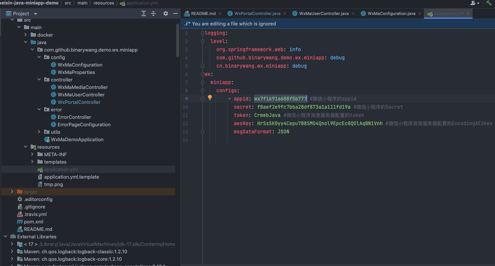
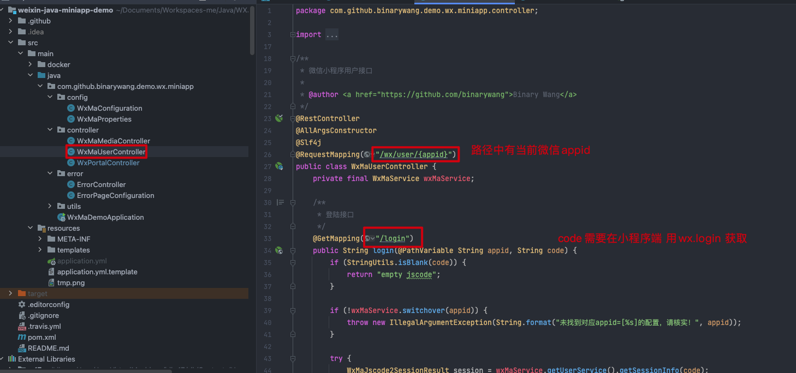
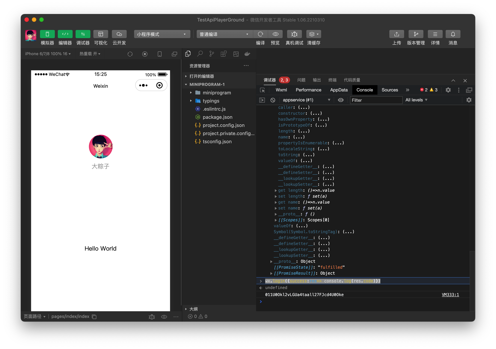
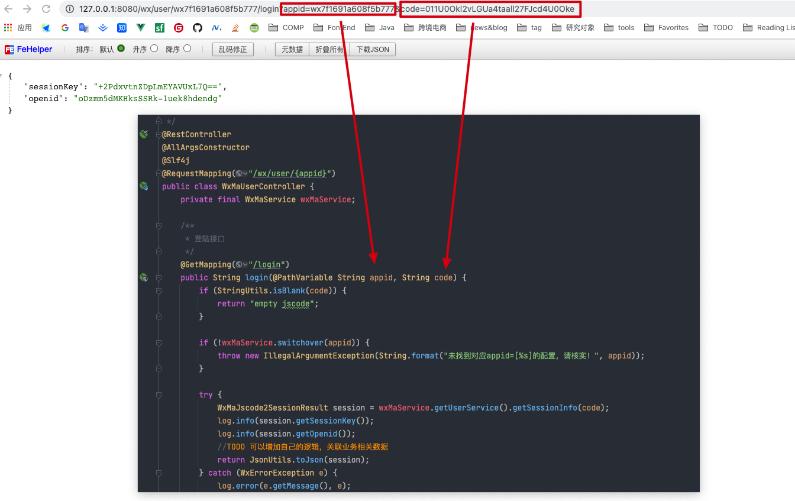
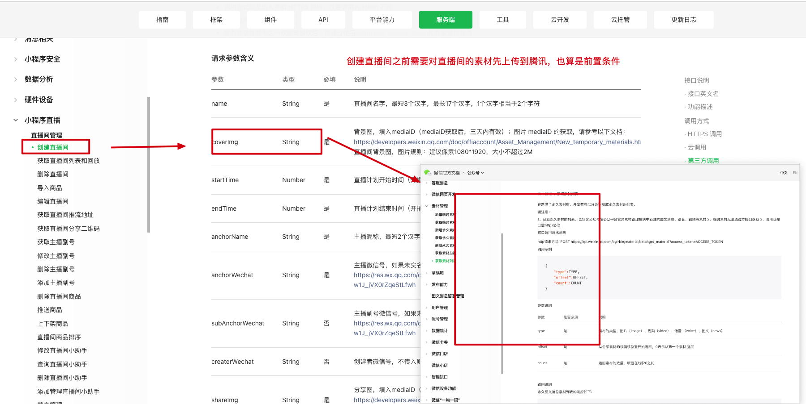

#### wx-Java的框架使用记录

github  https://github.com/Wechat-Group/WxJava

小程序的示例代码 https://gitee.com/binary/weixin-java-miniapp-demo#https://gitee.com/link?target=https%3A%2F%2Fdevelopers.weixin.qq.com%2Fminiprogram%2Fdev%2Fframework%2Fserver-ability%2Fmessage-push.html

根据readme.md文件提示配置如下文件

测试到底能不能正常登录

对于后端开发来说这个wx.login 获取code就比较恼人了，其实这也是微信的安全校验

用已经认证的微信小程序appid 创建一个空白小程序，在console中用下面的代码打印下即可

~~~js
wx.login({success:res=> console.log(res.code)})
~~~

上图console下面的code就是，注意有效期只有5分钟，下面的图片是启动了demo程序 传递参数调用登录成功的api结果

小程序直播间操作的前置素材上传操作

