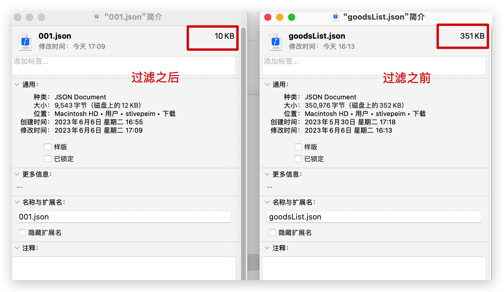

# 前景：移动端商城DIY功能中的优化项

### 优化项

1. 对组件配置数据的层级深度优化 最深不超过4级
2. 对组件配置的数据商城端解析做出优化，仅仅获取组件需要的json配置数据

*上面两项会从管理端的配置复杂程度到商城前段的解析效率都有所提升，避免商城端拿到管理端的全部配置来做配型行的渲染解析。*

<u>最终实现的结果就是：以goodsList.json为例 7k多行的配置数据最终净化后不到300行的样子。</u>

### diy数据交互

原理上是管理端通过配置后产出配置数据，移动端根据配置数据来渲染对应的组件。这个配置数据就是json形式的数据。

json数据的大小和节点数量会增加dom解析的成本，在弱网和低性能设备上展现的不尽人意。

以此为目的对其优化。

### 寻找合适的方式实现

组件种类繁多，业务不一样导致没个配置文件节点不一样，配置文件深度不一样，对应的待选项也不一样。在这个基础之上还需要对每个组件的json配置文件做有效的净化，想想都头大。但是为了前端商城的渲染效率这个事情还是要做的。

### 最终使用的方案 JSON-PATH


使用可开源库 [json-path/JsonPath: Java JsonPath implementation (github.com)](https://github.com/json-path/JsonPath)

```java
// 读取 JSON 文件内容
String jsonString = new String(Files.readAllBytes(Paths.get("xxxx/goodsList.json")));

// 创建 JSON 配置对象
Configuration configuration = Configuration.builder()
        .options(Option.SUPPRESS_EXCEPTIONS)
        .build();

// 使用 delete() 方法删除对应节点
Object parseContext = JsonPath.using(configuration)
        .parse(jsonString)
        .delete("$.itemStyle.list")
        .delete("$.tabConfig.list")
        .delete("$.typeConfig.list")
        .delete("$.selectConfig")
        .delete("$.goodsSort.list")
        .delete("$.goodsList.list[*].attrValue")
        .json();
System.out.println("绚丽的结果 \n " + JSON.toJSONString(parseContext));
```

### 实现方式的多重方式

1. 去掉不需要的节点（json文件大，去掉的数据小于最终需要保留的数据）
2. 仅仅加载自己需要的节点 （json文件大，但是自己获取的key就那么几个的情况下推荐）

### 最终实现 以goodsList为例

