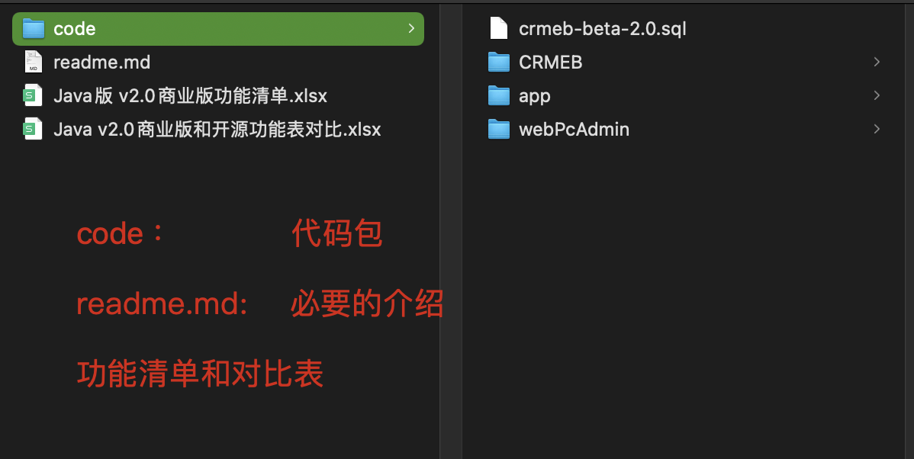
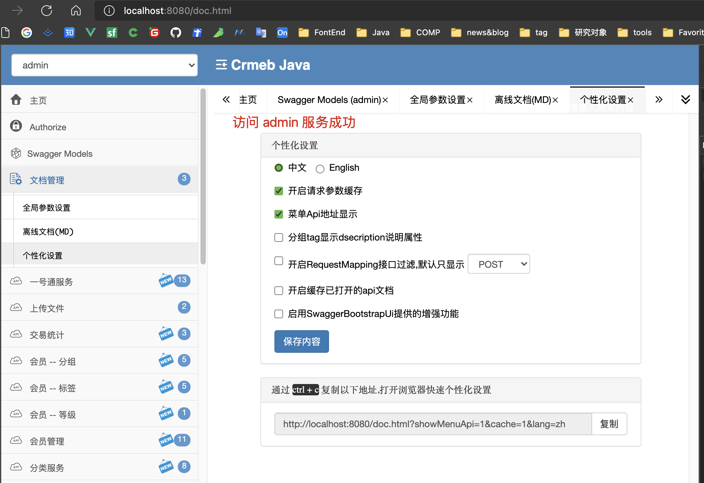
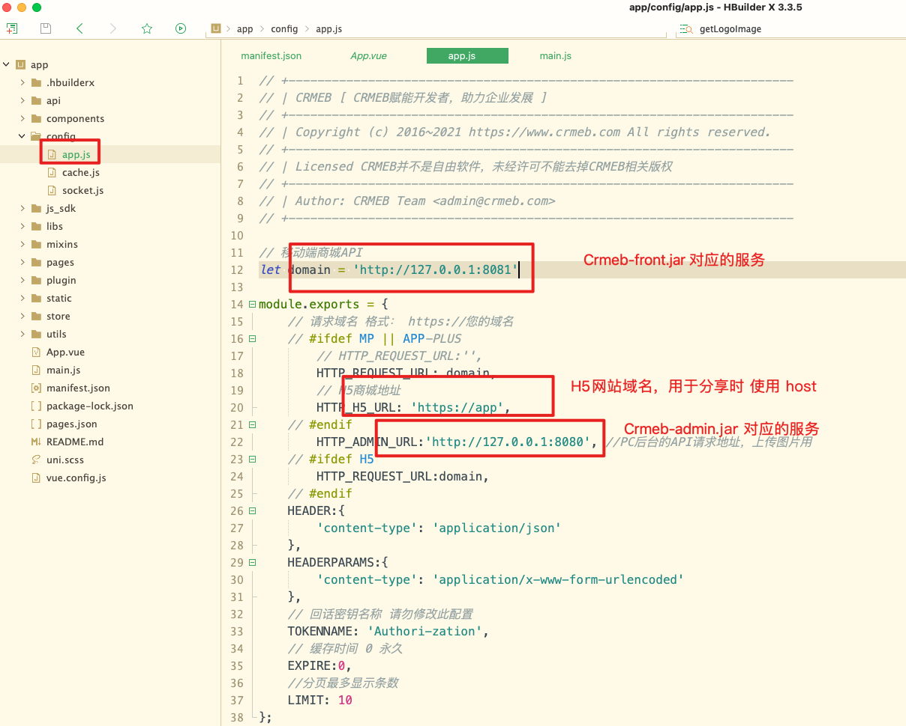

<iframe src="//player.bilibili.com/player.html?aid=892852049&bvid=BV1bP4y1n76P&cid=473716805&page=1" scrolling="no" border="0" frameborder="no" framespacing="0" allowfullscreen="true" height="600" width="100%"> </iframe>

# 本地开发环境 开源代码参见

 获取到源码后如下图，切记在初次搭建时不要随意修改源码与其运行配置无关的内容。不知道源码怎么下载看这里[CRMEB Java版单商户代码怎么下载和更新](https://doc.crmeb.com/web/java/crmeb_java/1980)

## 环境要求

~~~shell
Java项目运行环境 如果本地开发需要全部安装，仅仅打包只安装idea 即可
  1.Java Jdk1.8															各平台安装包		 https://cloud.189.cn/t/eUvimeeyQ7Vv
  2.Redis 5+																(最新版也可以)   https://redis.io/
  3.Mysql 5.7+															(必须5.7.x) 		https://www.mysql.com/downloads/
  4.Nginx																		(最新版即可)			http://nginx.org/en/download.html

Java项目框架
  1.SpringBoot 2
  2.Maven 3.6
  3.swagger-bootstrap-ui 1.0
  4.Mybatis Plus 3.3.1

WEB PC 项目运行环境
  1.npm 6
  2.node 14
  3.vue 2.x
  4.element ui 2.13

开发和运行项目工具
	1.移动端 uniapp代码 使用 HbuilderX 开发			(Hbuilder X)		https://www.dcloud.io/hbuilderx.html
	2.WEBPC 管理端只要支撑npm脚本即可，webStorm或者VScode都可以
	3.IntelliJ Idea java项目运行工具						（建议Idea）		 https://www.jetbrains.com/idea/
~~~

## 源码包介绍

## 准备工作

### 公共的软件服务

#### git

### Java 环境启动准备

#### 依次安装环境软件JDK，Redis，Mysql 如果自己用的外部服务直接忽略，直接导入SQL脚本即可。只有本地服务的需要在对应机器上安装如上软件环境

#### 安装Idea 编写，运行和打包Java 代码  如果你一直使用eclipse 也可以，标准的springBoot 模块代码

### WEB PC 环境准备

#### 需要有已运行的本地或者线上的api服务

#### 安装Node js

### 代码包介绍

## 启动Java 服务

### 启动Admin服务

以下全部的介绍都已 IntelliJ IDEA 为准。

很多经验丰富的同学已经使用公测包都运行起来了，其实2.0和原来的代码运行方式类似，也就是件java的模块分包，原来一个jar 提供了管理端和商城端两个服务，现在为了集群，将WEBPC 管理端的服务和 移动端商城区分开了。

原来启动一个jar服务 现在需要分别启动2个

##### 代码包介绍

idea 导入代码后

##### 启动 admin 服务

1. 在crmeb-admin 包下找到 不带环境描述的yml文件
2. 修改crmeb 配置节点下的 imagePath 为自己本地项目实际的crmebimage的上一级目录 和1.x 不同的是 2.0取消 本地单独需要nginx图片服务的限制 直接tomcat 挂载附件节点，较少图片配置难易程度。
3. 修改 server.port  tomcat 端口 如果需要的话
4. 修改 mysql 链接地址 口令等
5. 修改 redis 链接地址 密码

如下图

选择对应的启动程序 -- 如果这里不显示 可以点击上面的 Edit Coinfiguration 中手动根据目录选择下。

点击上图红框 右侧的运行（绿色小三角） 或者debug（绿色小虫子）启动CRMEB admin服务 

访问admin对应的swagger文档 

到了这一步 admin 需要的Java 服务我们已经启动成功

### 启动Java Front服务

Front 服务是针对移动端商城的服务 2.0 代码中区别于1.x  区分 服务端jar和商城端jar 启动front和 admin一样，仅仅是端口不同

## Web PC 管理端启动

项目根目录下安装依赖

~~~shell
npm install							-- 安装项目依赖
npm run dev							-- 启动开发环境
npm run build:stage			-- 编译测试环境
npm run build:prod			-- 编译生产环境
~~~

很多朋友会卡到 npm install 这个步骤，可以使用cnpm 或者 淘宝镜像 华为也有私有服务。有条件的同学可以科学上网无障碍使用。

淘宝镜像

~~~shell
 npm install --registry=https://registry.npm.taobao.org
~~~

华为云使用方式

[华为开源镜像站新手指导（NPM篇）_开源镜像站_DevCloud_华为云论坛 (huaweicloud.com)](https://bbs.huaweicloud.com/forum/forum.php?mod=viewthread&tid=1803)

无论哪种方式和install 成功为目的。

本地运行修改环境文件

下一步 npm run dev 启动 WEB PC 管理端服务 前提是 开发环境你对应的api地址要设置正确

可以使用demo账户直接登录或者用默认admin / 123456 登录

设置本地api域名作为图片域名

本地Web PC 管理端启动成功。如果期间有个别地方运行不正确可以在论坛留言

## Uniapp

### H5本地调试

#### 代码位置

#### 打开提前安装好的Hbuildr X 并根据目录导入 上图中的uniapp 代码

如图修改api配置

H5 启动 本地调试

### 微信小程序本地调试

首先修改uniapp代码中你自己的微信appId

运行当前代码到微信开发者工具，前提必须安装微信开发者工具，并且在通用安全中开启端口，以免uniapp 不能直接打开微信开发者工具

能够正常从Uniapp打开微信开发者工具 需要设置有开发者权限的微信小程序appId 到配置清单文件中 manifest.json，并且微信开发者工具已登录自己的账户

如图运行出现白屏别着急继续往下看

如果到这一步还发现图片加载不正确那么需要去，WEBPC 管理端设置 对应图片域名即可，或者正确开启OSS

### App 本地调试

mac 基本上自带呢IOS Win环境要么安装Android Stuido 或者一些android模拟器 推荐网易mumu

截图已 Mac 环境为例 ， Android设备启动后基本上Hbuilder X 会自动识别 如果没有识别到，需要自己添加模拟器对应端口即可。

启动中

编译成功

本地搭建开发环境时遇到问题可以论坛留言

https://q.crmeb.com/?categoryId=122&sequence=0

👍👍👍👍👍👍👍👍 打包过程中如果出现错误等问题环境论坛提问 [Java系统 - CRMEB社区](https://q.crmeb.com/?categoryId=122&sequence=0)
