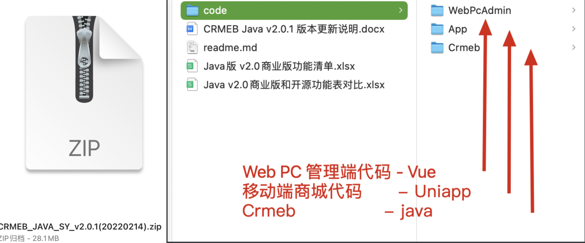
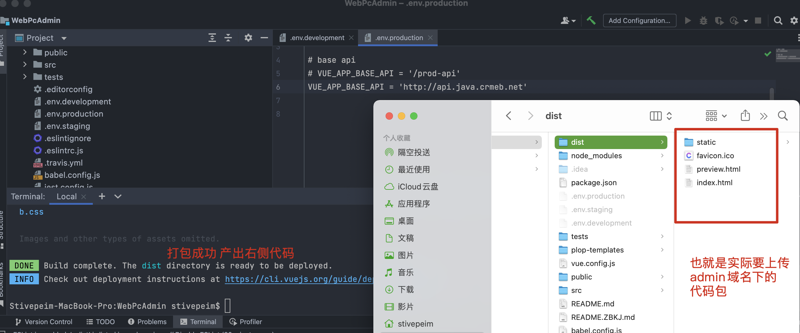
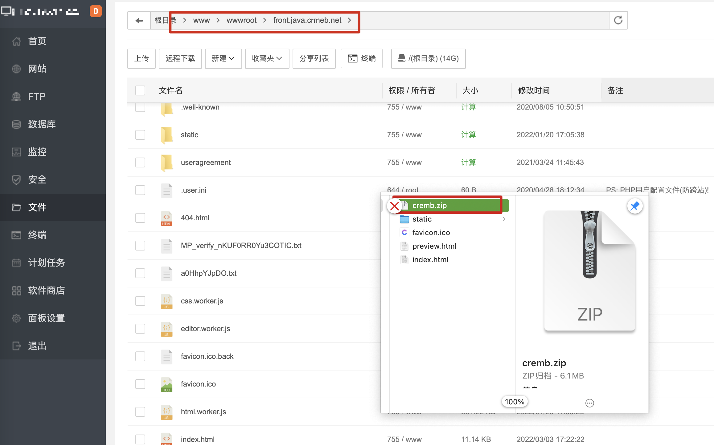
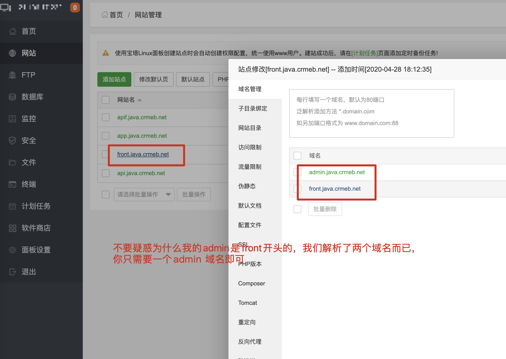
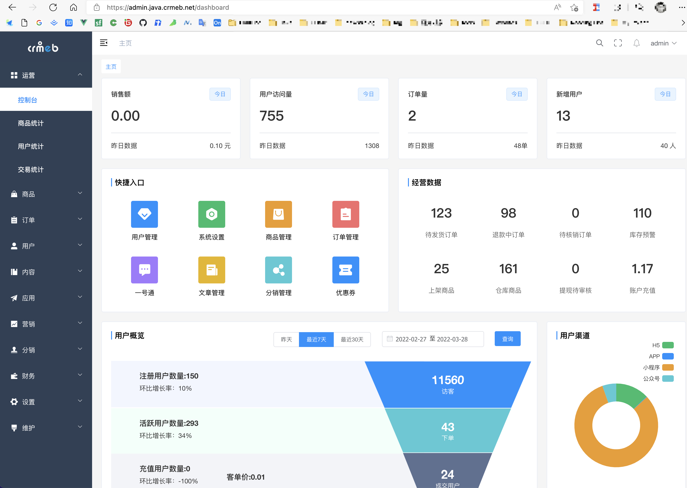
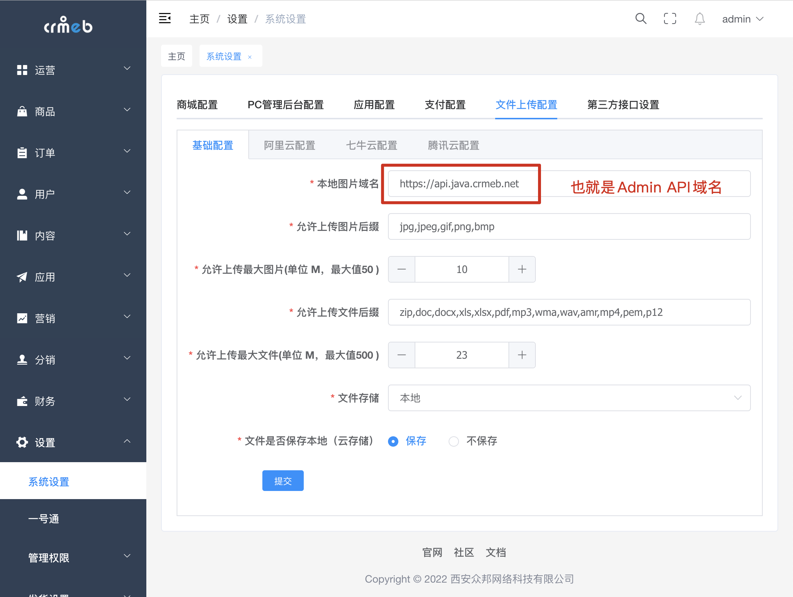
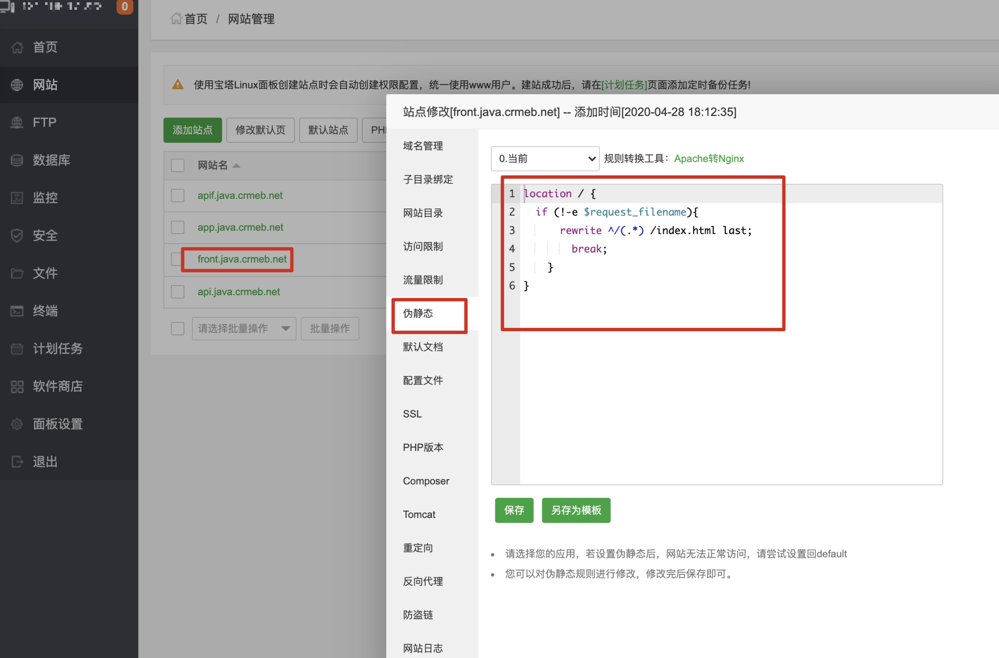
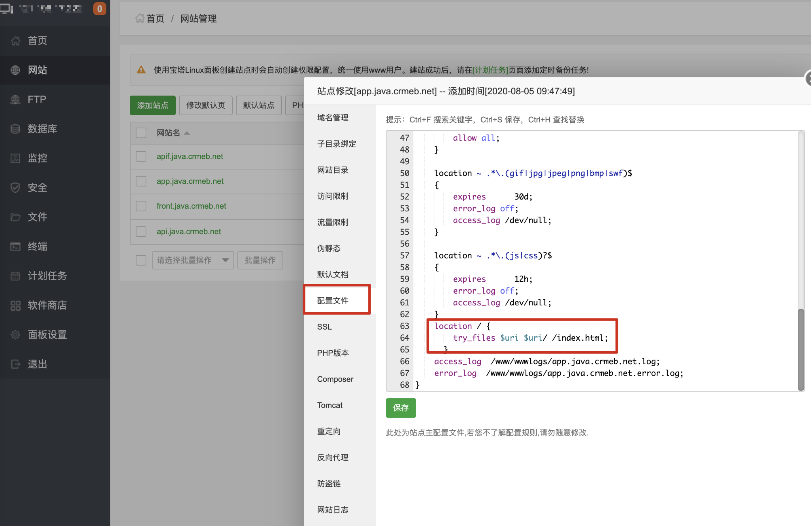

# 📈WEB PC 管理端打包

## 下载的源码，并导入开发工具

解压后的代码包内容

设置prod 环境api地址为java admin对应的域名，Vue代码没有install 的需要先intsall之后再打包。

打包成功后压缩源码并上传到admin域名下

图中的admin和front是同一个站点 只要有admin域名访问通即可，只是我们多解析了一个域名。

访问WEB PC 管理端

如果出现默认图片加载不正确的，需要如下图设置，本地图片域名即可。

刷新出现404的问题需要设置伪静态，以下两种配置方式**二选一** **二选一** **二选一**

第一种配置方式

](../../../images/202203281511453.png)

~~~nginx
location / {
	if (!-e $request_filename){
    	rewrite ^/(.*) /index.html last;
        break;
    }
}	
~~~

第二种伪静态配置

~~~nginx
location / {
  try_files $uri $uri/ /index.html;
}
~~~

以上步骤已经将WEB PC 管理端部署成功！

👍👍👍👍👍👍👍👍 WEB PC 管理端打包过程中如果出现错误等问题，论坛提问 [Java系统 - CRMEB社区](https://q.crmeb.com/?categoryId=122&sequence=0)