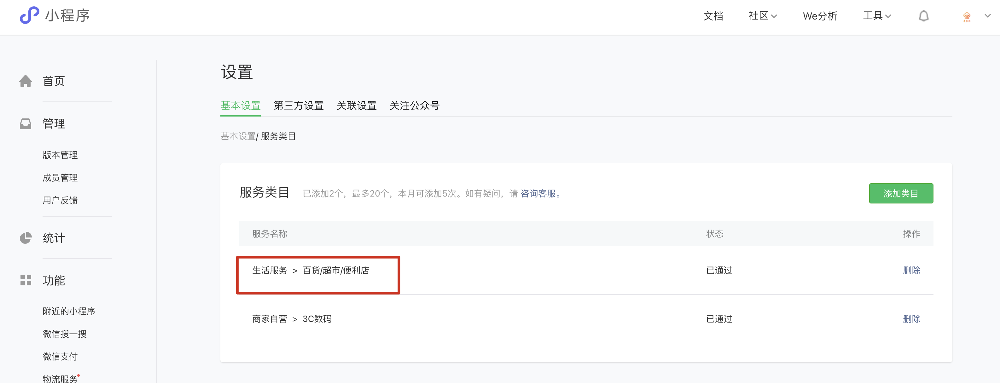
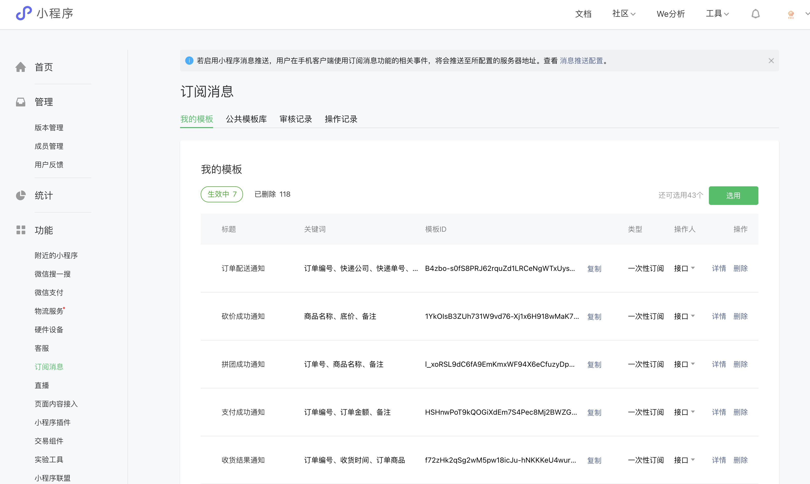
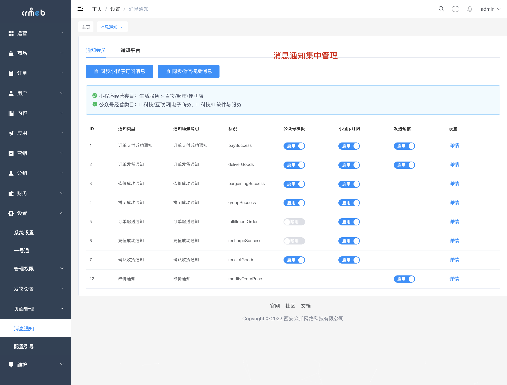
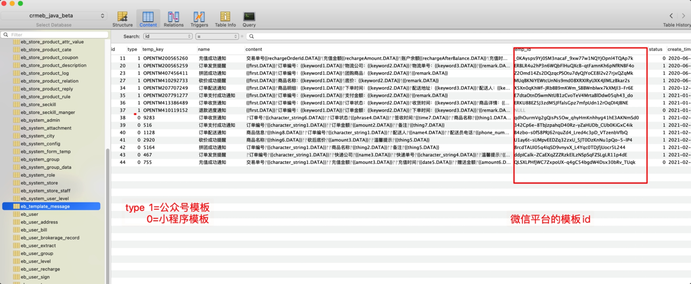

1. 选择服务类目：IT科技/软件服务提供商、生活服务/百货/超市/便利店**（类目一样的情况下默认模版可以使用）**

   

2. 进入微信公众平台、小程序后台：功能->订阅消息。（如未开通，点击申请即可开通)

3. 管理系统查看现有模板列表
    
4. 根据模版编号或者名称，在微信公众平台模版库中搜索模版，
5. 如下图所示在对应表中更新模板id即可，保证复制粘贴的正确性，错了发不出通知哦
   

   > **注意：**
   > 因每个小程序对应的类型不一致，且微信通知模板会不定期更新，需要根据自身业务选择对应业务场景的模板
   >
   > 更新上图表中对应的微信模板id 后再对比模板内容，参数对不上的情况下，需要根据ID查询使用模板的业务代码更改对应参数。

👍👍👍👍👍👍👍👍 设置中如果出现其他不能处理的问题，欢迎论坛提问 [Java系统 - CRMEB社区](https://q.crmeb.com/?categoryId=122&sequence=0)

