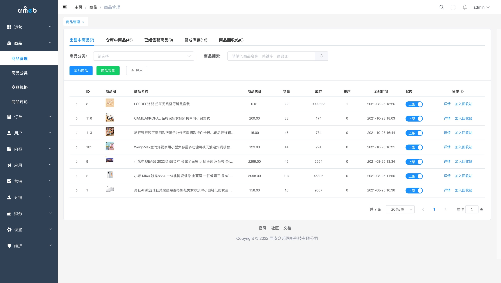
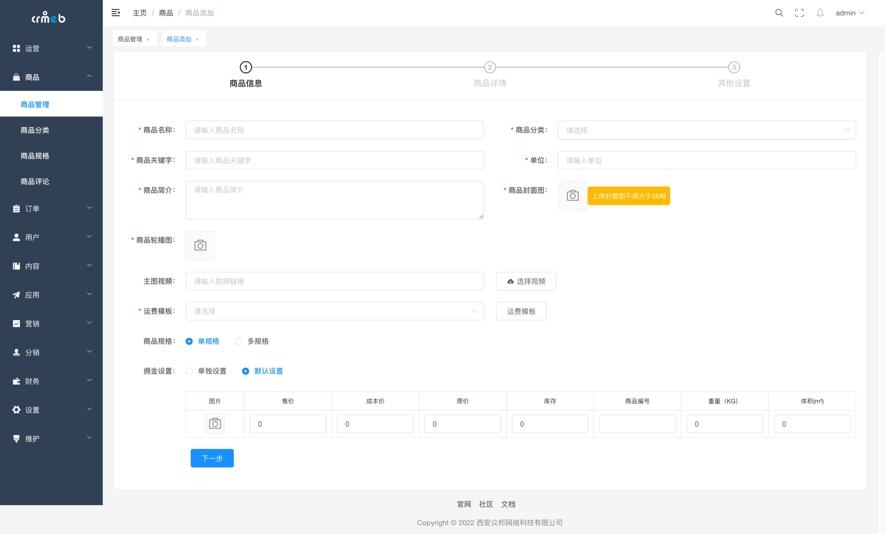
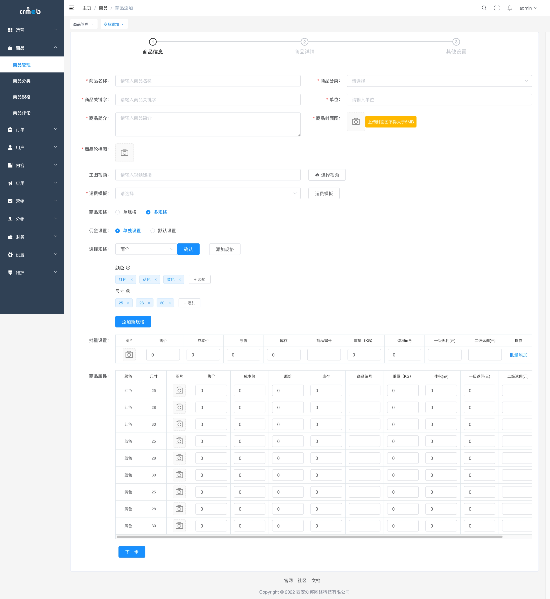
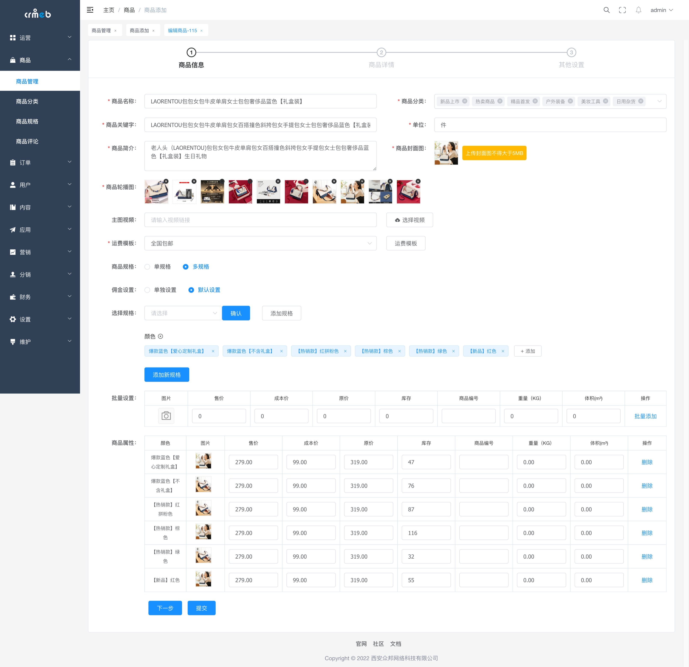
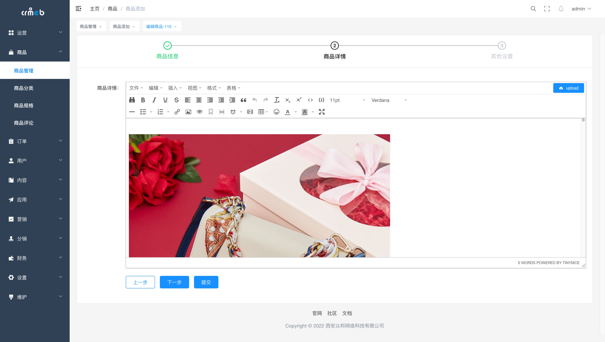
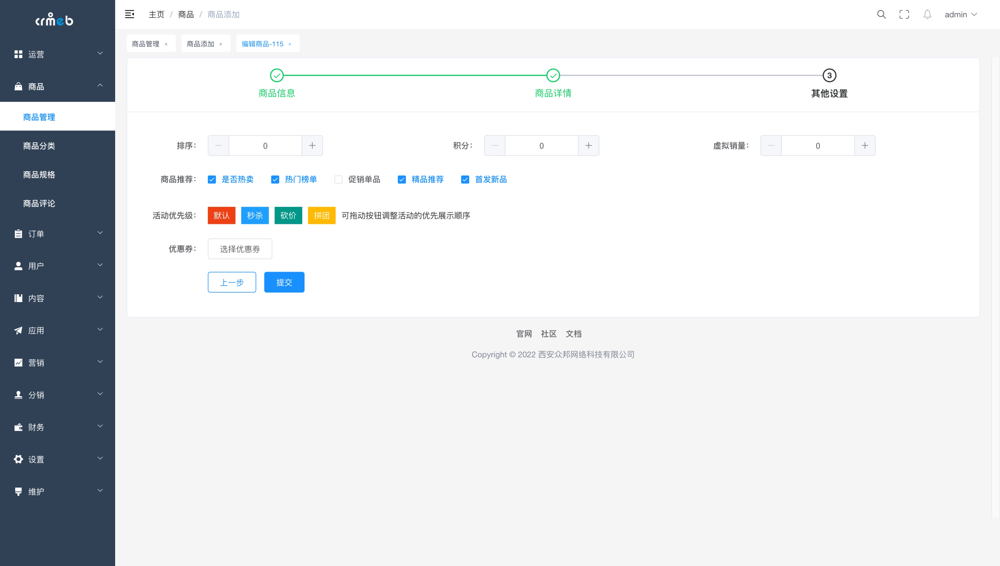
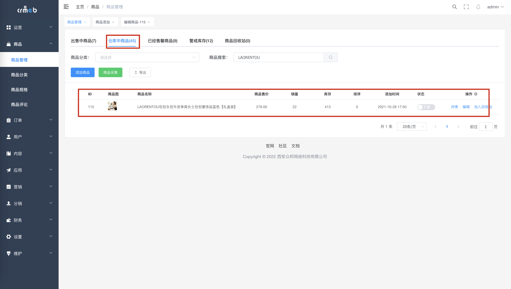
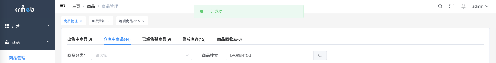
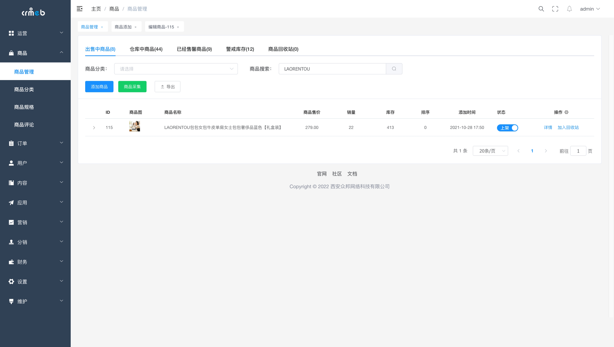

# 添加商品

### 一、功能介绍

商品模块是商城的重要模块，商城的运营、活动等均围绕商品展开，添加商品也是运营的第一步。

商品分别有如下5种状态：根据状态的名称也能看出他们所在处的位置

1. 出售中商品（已上架的商品，出现在商城各个端中，H5，小程序，公众号，APP，PC商城(安装有时)）
2. 仓库中商品  (已下架的商品，不会出现在商城在售商品列表中)
3. 已经售罄商品 （已上架的没有库存的商品，出现在在售商城列表中但因没有库存，所以无法下单）
4. 警戒库存  （已上架商品，根据设置的警戒值 出现在该状态下）
5. 商品回收站 （包含上架和下架状态的商品）

### 二、操作流程

商品 ＞ 商品列表 ＞ 添加商品

### 三、功能说明

> 商品信息
>
> 商品规格 单规格/多规格

👍👍👍👍👍👍👍👍 如果有问题，欢迎论坛先搜索再提问 [Java系统 - CRMEB社区](https://q.crmeb.com/?categoryId=122&sequence=0)