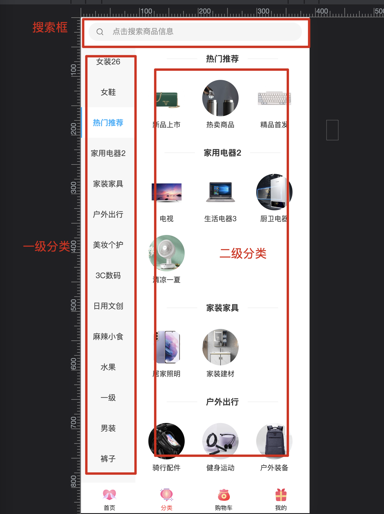

# 商品分类

## 分类介绍

可以在设置 页面设计中选择适合自己的分类样式

## 后台点击“商品”--“商品分类”添加管理分类

1.  添加一级分类：

*   打开“商品分类”页，点击左上角“添加分类”
*   在弹框中，父级选择**顶级菜单**
*   输入分类名称、图片、排序、状态（前端显示或隐藏）
*   提交保存

2.  添加二级子分类：

*   点击左上角“添加分类”
*   在弹框中，父级选择**对应的一级分类**
*   输入分类名称、图片、排序、状态（前端显示或隐藏）
*   提交保存

> 注意事项：
>
> 删除一级分类，需要先删除该一级下的所有二级分类；删除二级分类需要先删除该分类下的所有产品。
>
> 目前系统只支持二级分类，只添加一级或者添加超过二级，都无法正常使用。
>
> 分类图标建议上传180\*180，不宜过大，否则造成系统加载速度过慢。

👍👍👍👍👍👍👍👍 如果有问题，欢迎论坛先搜索再提问 [Java系统 - CRMEB社区](https://q.crmeb.com/?categoryId=122&sequence=0)