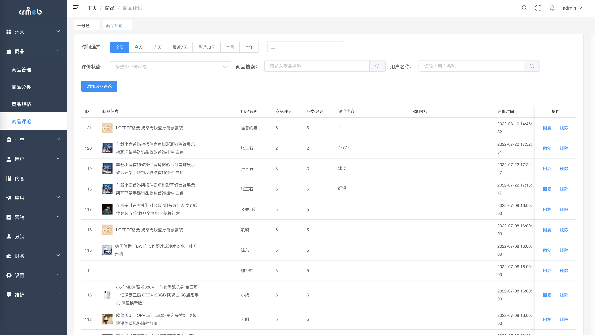
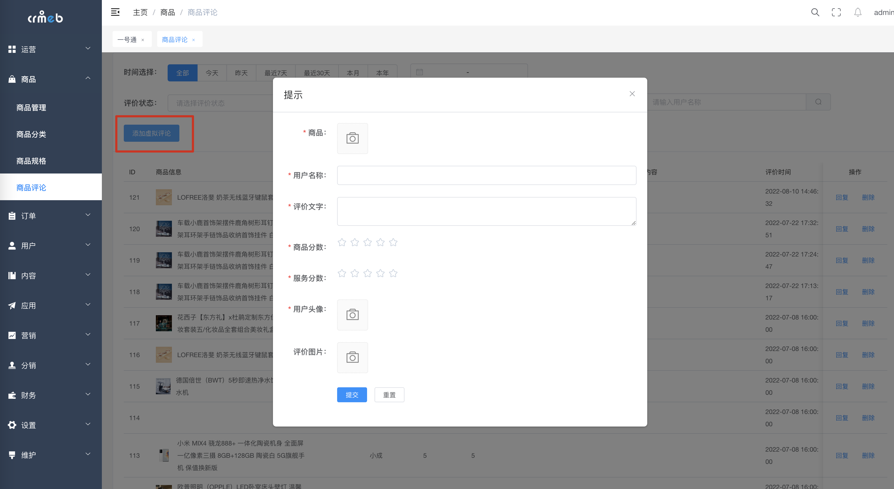

# 商品评论

### 评论列表

> 评论数据列表来自于线上售卖商品后用户添加的商品评价后才会出现
>
> 回复：针对应付的评论回复，多次回复会覆盖
>
> 删除：逻辑删除用户评论 不可逆

### 虚拟评论

### 新增虚拟评论

> 商城运维初期使用，后台可以新增商品评价。

👍👍👍👍👍👍👍👍 如果有问题，欢迎论坛先搜索再提问 [Java系统 - CRMEB社区](https://q.crmeb.com/?categoryId=122&sequence=0)

