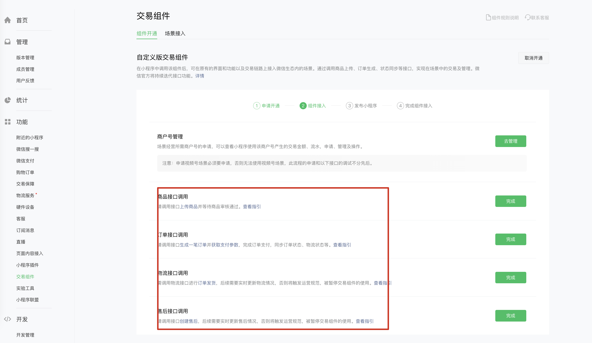
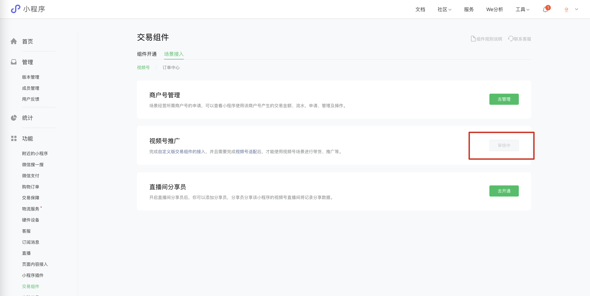

# ？1. 微信小程序开通

---

# 2. 📹 微信自定义交易组件开通

---

**Q**：什么是微信自定义交易组件

**A**：简单来说可以把微信自定义交易组件，当作从微信视频号入口购买自己小程序商品的一个通道。

> 官方是这么解释的：在小程序中调用该组件后，可在原有的界面和功能以及交易链路上接入微信生态内的场景。通过调用商品上传、订单生成、状态同步等接口，实现在场景中的交易及管理。微信官方将持续迭代接口功能。
>
> **一张图看清他们的区别**
>
> 

### 🎯 2.1 下面我们一步步的来开通自定义交易组件 - 商户填写资料签协议 - 相对简单

> 开始之前确认小程序已经认证
>
> 签署协议
>
> 
>
> 满足申请的各种步骤 填写商户号之后一步步调用微信api实现接入审核
>
> 
>
> 商户资料填写，也可以是个体工商户
>
> 
>
> 商户资料填写完后 审核中
>
> 
>
> 法人扫码签署协议
>
> 
>
> 
>
> 商户开通交易组件成功
>
> 
>
> 商户申请成功之后就可以开始调用后台api完成验证了 
>
> 

### 🚶‍♀️ 2.2 开始一步步调用api完成交易组件的验证 - 这是一个头疼的事情一步步来不要着急，先整理好心情以免砸电脑

> 有用的帖子，有接入经验的大佬可以绕行，第一次接入或者之前接入不成功的建议参见 [腾讯官方社区- 新版自定义交易组件接入指引（更新售后流程相关内容）](https://developers.weixin.qq.com/community/develop/article/doc/0004e049970bd07473cdb0e575b013?page=1#comment-list)
>
> 开始根据提示不不不调用API完成校验，注意的是有些订单接口必须是在服务端调用，因为有ip白名单的限制。可能是为了安全考虑但对于刚开始接入api的朋友真心不友好，最简单的就是自己解析个测试域名重定向到https://api.weixin.qq.com 这样就可以用自己的域名直接一次性设置服务器白名单之后直接调用微信的API 进行调试了，起初我也用的 postman 
>
> 
>
> 商品信息调用成功
>
> 
>
> 创建点单成功之后获取支付参数，然后小程序开发工具中点击发布，切记，发布时需要填写appid ，一定要和当前微信小程序对应
>
> 
>
> 校验支付 和 物流成功
>
> 
>
> 
>
> 售后校验成功
>
> 
>
> 接下来就开始测试和发布小程序
>
> 
>
> **至此小程序 交易组件接入，调用api的验证已经通过 离成功已经很近了😊**

### 🧪 2.3 测试和发布小程序

> 通过uniapp 发布小程序后 点击测试小程序 如果不知道怎么编译小程序可以参照之前的章节
>
> 测试小程序通过验证
>
> 
>
> 发布小程序后 通过校验
>
> 

### 2.4 ⭕️ 场景接入

> 确认商户号没问题 也就是刚开始开通时填写的 没问题之后就开始介入场景
>
> 
>
> <u>简单解释下这歌步骤的操作：也就是让直播的时候可以带货，带货后可以选择通过api上传的商品，以供视频号直播时下单</u>
>
> 
>
> 等待审核结果 如果上面的测试等都过了，这里一般都会审核通过。如果审核拒绝，请检查线上已经发布的小程序是否能正常访问。
>
> 
>
> 场景接入审核成功，如果失败的话也会有红色字体提示，跟着处理问题就好。 祝你好运
>
> 
>
> 添加对应推广员 也就是带货的人
>
> 

### 🎆  2.6开通后在平台上创建商品过审后就可以从视频号下单了

至于怎么从视频号上架商品和购买流程见下面示例视频