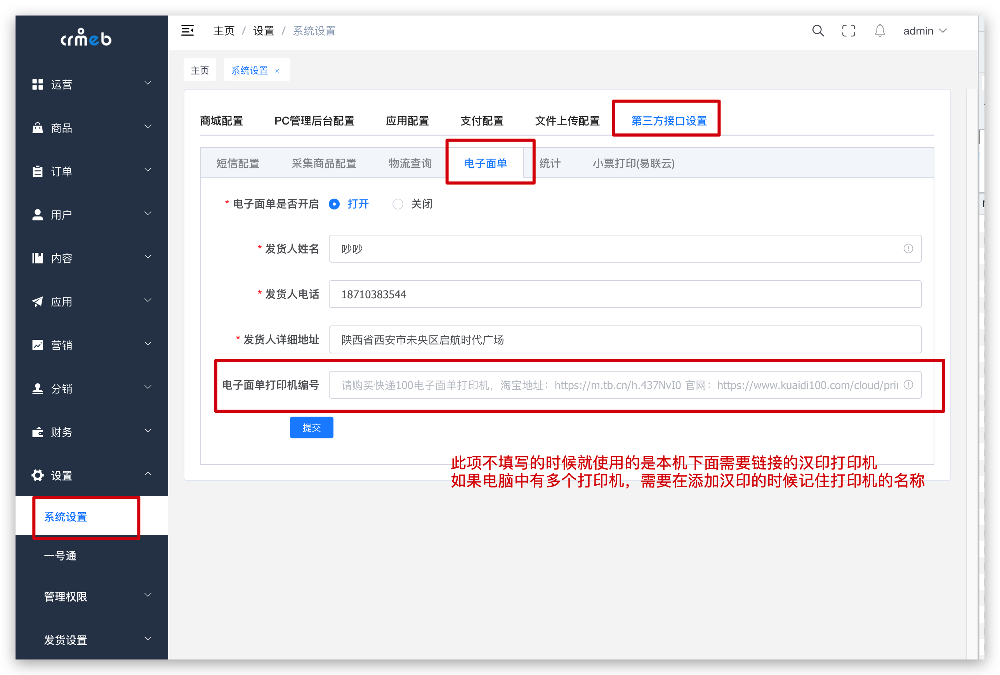
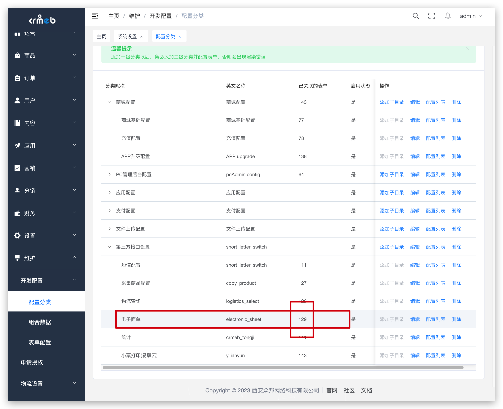
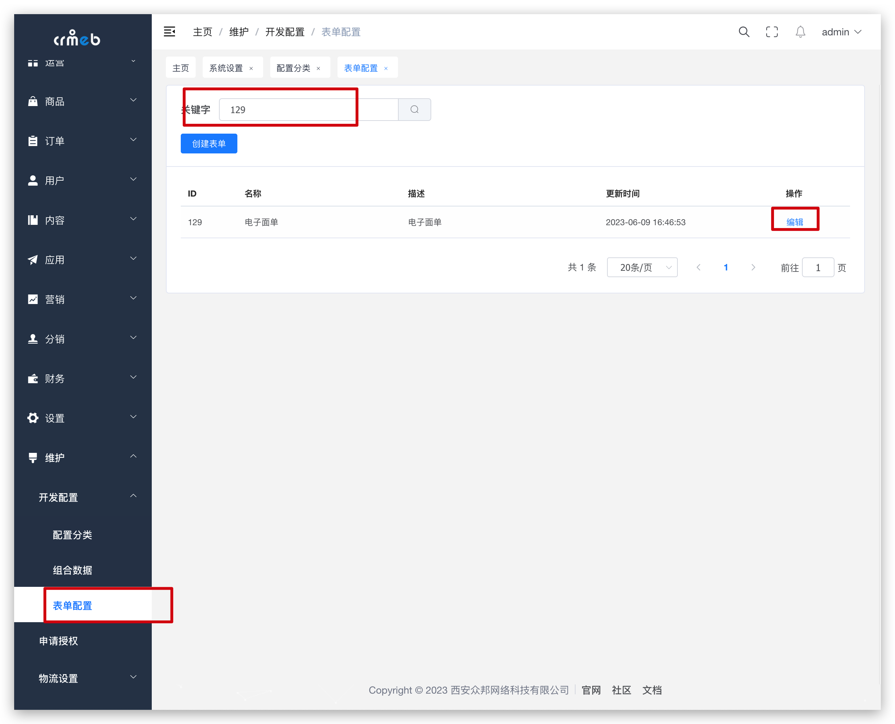
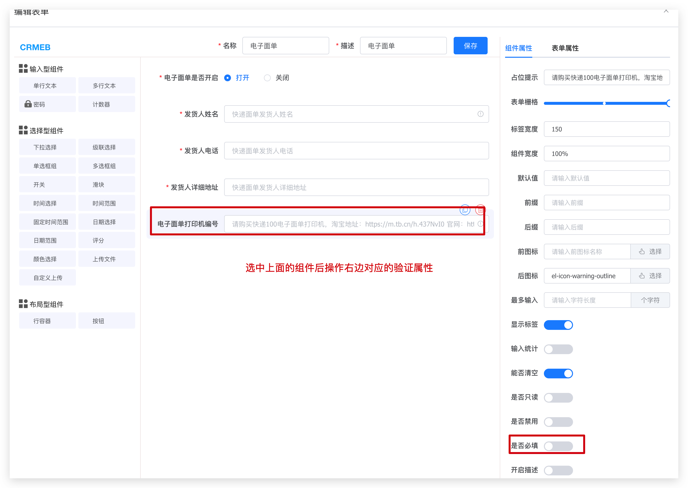
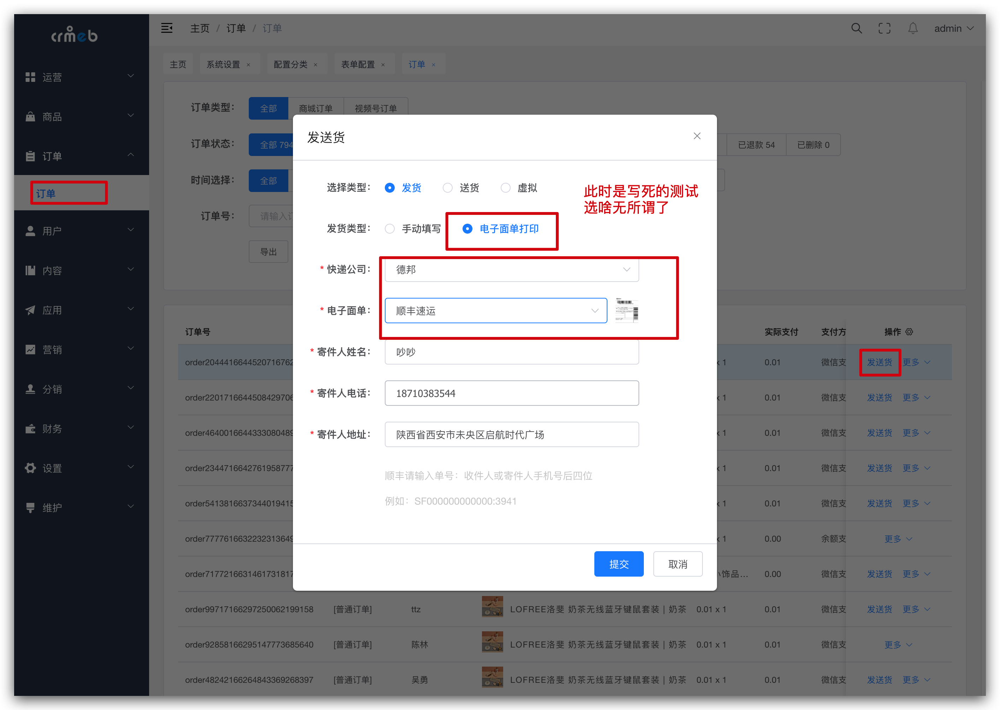
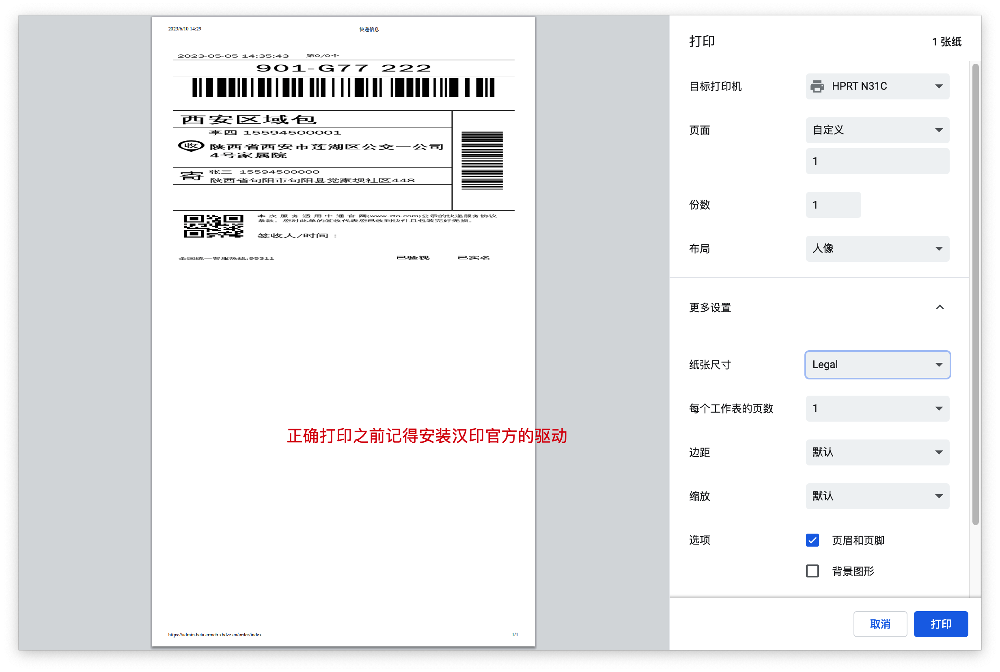
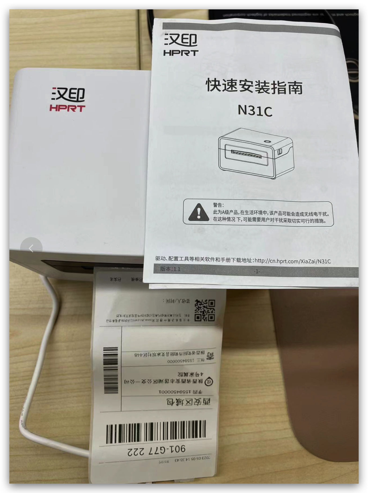

# 单商户升级电子面单打印 - 汉印打印机

## 升级前注意

源码下载后根据括号中的日期在20230610之后的可以直接配置使用即可

怎么判断用的是快递100的还是汉印的打印机



有可能会二开，在配置分类中确认当前电子面单的表单路径



如果二次开发过根据自己的配置找到自己修改过的表单即可，如图上 配置的表单id 是129



设置表单中原来的必填验证



修改后即可和图1一样 删除打印机编号即可使用本机链接的 **汉印打印机** 打印电子面单

## Java源码更改位置

一号通服务 端有参数兼容，Java程序也需要对应调整，如下所示。

修改路径 src/main/java/com/zbkj/service/service/impl/OnePassServiceImpl.java

```java
/**
 * 电子面单
 * 兼容老设备 siid参数不存在的时候必须填写，print_type=IMAGE 返回面单图
 * 并且Header中再新增一个version=v1.1的参数
 * @param record 电子面单参数
 * @return
 */
@Override
public MyRecord expressDump(MyRecord record) {
    HashMap<String, String> header = onePassUtil.getCommonHeader(onePassUtil.getToken());
    MultiValueMap<String, Object> params = new LinkedMultiValueMap<>();
    Map<String, Object> columns = record.getColumns();
    logger.info("电子面单原本的参数:{}", JSON.toJSONString(columns));
    Object siid = columns.get("siid");
    logger.info("原始数据的siid数据:{}", siid);
    if(ObjectUtil.isEmpty(siid)){
        columns.put("print_type", "IMAGE");
        header.put("version", "v1.1");
    }
    columns.forEach(params::add);
    logger.info("请求前参数params:{}", JSON.toJSONString(params));
    logger.info("请求前参数header:{}", JSON.toJSONString(header));
    columns.forEach(params::add);
    JSONObject post = onePassUtil.postFrom(OnePassConstants.ONE_PASS_API_URL + OnePassConstants.ONE_PASS_API_EXPRESS_DUMP_URI, params, header);
    MyRecord myRecord = new MyRecord();
    JSONObject jsonObject = post.getJSONObject("data");
    return myRecord.setColums(jsonObject);
}
```

## Vue管理端更改位置

打开WEB PC 管理端，也就是VUE项目，安装打印的JS 插件

```javascript
npm i printjs --save
```

修改源码路径

src/views/order/orderSend.vue

如下：

```javascript
putSend:Debounce(function(name) {
        // 打印测试
        this.printImg("http://api.kuaidi100.com/label/getImage/20230505/FBA3DFCE5C684CB9A13DADA8EE8357FB");
        // 正常业务中使用
        // this.formItem.orderNo = this.orderId;
        // this.$refs[name].validate((valid) => {
        //   if (valid) {
        //     orderSendApi(this.formItem).then(data => {
        //       // data -》 label是一个网络图片地址，直接打印即可
        //       this.printImg(data.label);
        //       this.$message.success('发送货成功');
        //       this.modals = false;
        //       this.$refs[name].resetFields();
        //       this.$emit('submitFail')
        //     })
        //   } else {
        //     this.$message.error('请填写信息');
        //   }
        // })
      }),
```

如上图描述打印测试后再开启正式业务中的逻辑代码。

## 确认打印结果

在系统中找一个订单，点击发货打印电子面单测试结果，







**注意：切记在使用正式打印电子面单时必须要正确配置有效的月结账号以及购买一号通电子面单打印次数之后才可以正确使用**