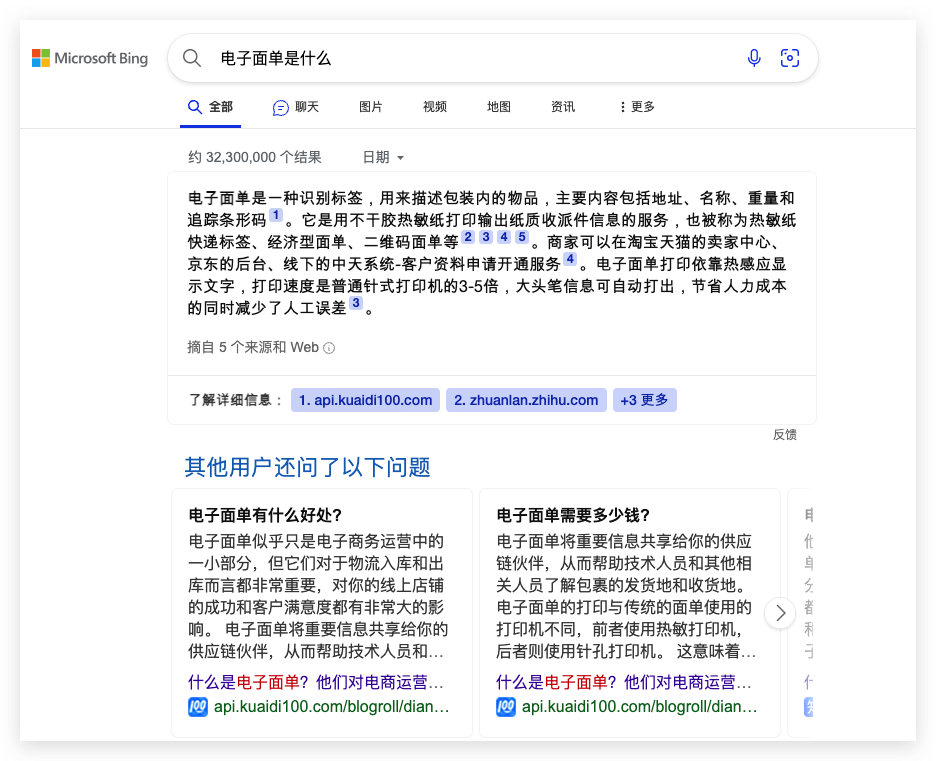
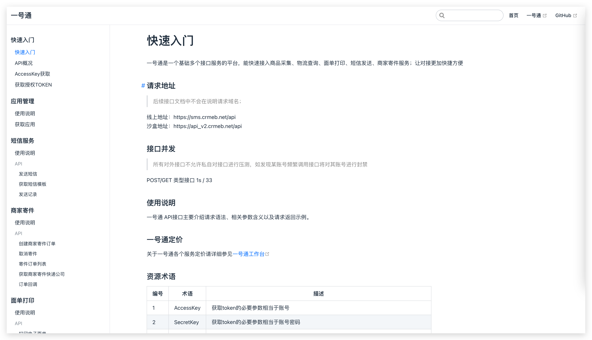
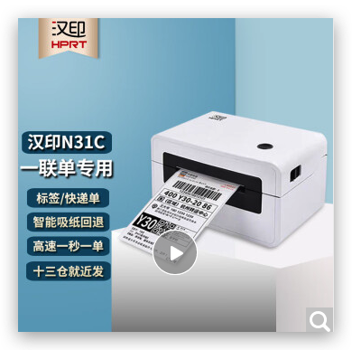

# 电子面单打印 - 汉印

## 什么是电子面单

虽然不是快递行业的专业人士，但是看起来就是能快速发快递的一个单子，只是用特定的纸张和打印机打印出来。

## 为什么要用汉印打印机

CRMEB所有的系统中都接入的是我们自己的第三方服务 **一号通** 

一号通提供的服务分别有  [参照一号通链接介绍](https://api_v2.crmeb.net/docs/%E5%BF%AB%E9%80%9F%E5%85%A5%E9%97%A8/)

**使用障碍：**原本使用的是快递100的电子面单打印机，但因为某种原因不能正常购买，先推出如下解决方式。

**使用汉印：**[汉印打印机介绍](https://cn.hprt.com/)          [购买链接](https://item.jd.com/66833157975.html?cu=true&utm_source=www.crmeb.com&utm_medium=tuiguang&utm_campaign=t_2015046557_&utm_term=f7eae816d38c4b3bae7f657448188ed7)

## 怎么配置才能正确使用汉印打印机

购买汉印打印机之后访问 **[官方](https://cn.hprt.com/)** 下载对应型号以及设备的驱动(win / mac)

操作方法如普通打印机一致，USB链接到电脑后添加本地打印机即可，根据官方指引设置驱动和参数即可直接打印。

[CRMEB单商户升级到汉印打印机](https://www.crmeb.com/ask/thread/30737) / 20230610之后的源代码可根据配置直接使用

CRMEB多商户升级到汉印打印机 / v1.3版本之后的可直接根据配置使用

