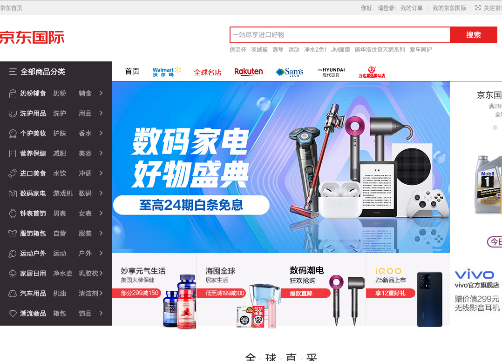
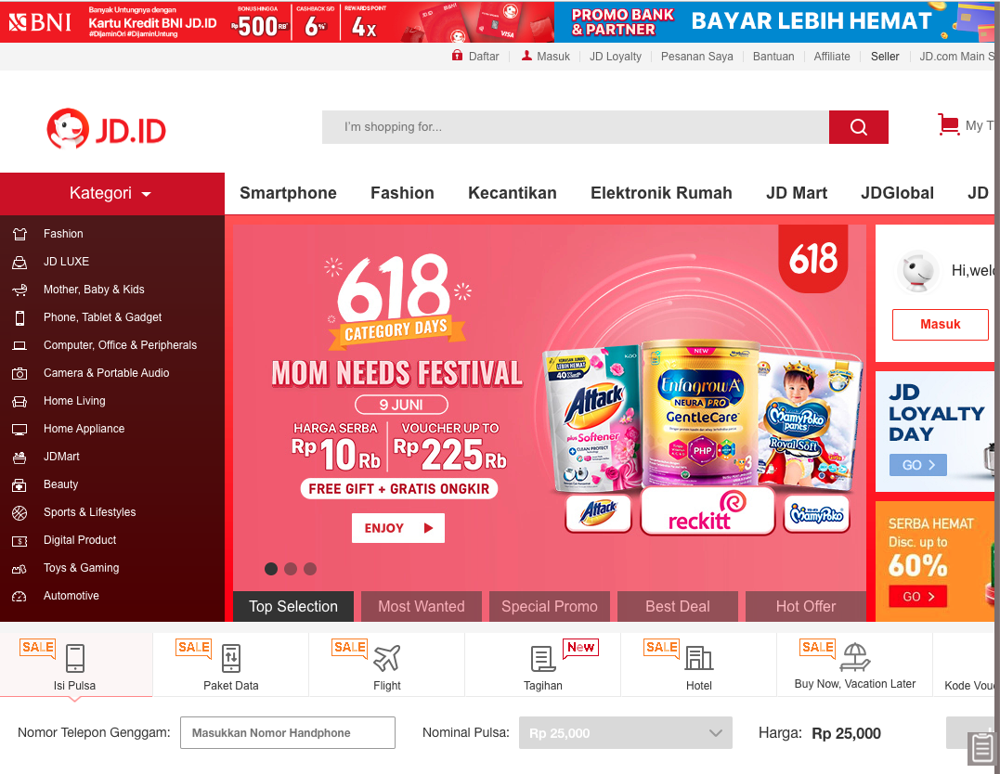

# 序言

### 项目介绍

CRMEB Java 外贸版多商户 旨在给国人，将商品卖到全球而努力。目前是以国家为单位运营。

比如京东  如下列表，Amazon也是针对国家运行，有兴趣的可以切换国家语言试试，比如老挝等国家文字阅读由右往左，切换后会发现阅读习惯都会改变，这种接地气的配置还是蛮好玩的。

JD香港站点		[京东国际_海外购_海外购物网_100%正品保证-京东 (jd.hk)](https://www.jd.hk/)

JD印尼商店		[JD.ID : Toko Online Terpercaya Indonesia | Dijamin Original](https://www.jd.id/)

JD俄文站点		[JD.RU](https://www.jd.ru/)

JD英文站点    	[Joybuy - High-Quality Product Wholesale, Customization and Logistics Distribution Platform](https://joybuy.com/)

JD的泰国站点    [เจดีเซ็นทรัล | JD CENTRAL จอยชัวร์ ตัวจริง | ช้อปปิ้งออนไลน์](https://www.jd.co.th/)

##### 结合自身优势

1. 有货源有技术
2. 已经在搞外贸，甚至境外都有自建仓
3. 已经在各大外贸平台铺货，但受不了平台规则的

### 技术栈

Java，SpringBoot, Redis, Mysql，Uniapp，Vue+ElementUI，NuxtJS等。

### 名词解释

Java 技术占比相对较大的市场份额。

SpringBoot Java程序员必知必会的开发框架。

Redis 高性能缓存。

Mysql 占比最高的关系行数据库。

NuxtJS  直观的 Vue,框架,使用 Nuxt 自信地构建您的下一个 Vue.js 应用程序。一个开源框架，使 Web 开发变得简单而强大。 https://nuxtjs.org/。

Uniapp  是一个使用 [Vue.js (opens new window)](https://vuejs.org/)开发所有前端应用的框架，开发者编写一套代码，可发布到iOS、Android、Web（响应式）、以及各种小程序（微信/支付宝/百度/头条/飞书/QQ/快手/钉钉/淘宝）、快应用等多个平台。https://uniapp.dcloud.io/。

Vue 前端开发人员必备技能，10个前端开发可能5个会React 但会vue的绝对有10个。

### 运行环境 及 技术亮点

##### 后端

1. JDK 1.8
2. Maven 3.3.x
3. Mysql 5.7.x
4. Redis 最新版即可
5. Nginx 最新版即可

##### 前端

1. Vue 2.x
2. ElementUI
3. Uniapp
4. NuxtJS

##### 开发环境

1. IntelliJ IDEA java开发和运行jdk
2. WebStorm(可以在IDEA中安装插件实现) 纯前端开发环境
3. Hbuilder X 运行uniapp官方开发工具
4. Chrome 或者 Edge 最新版本的浏览器

#### 网络要求

目地是将商品售卖给老外，赚老外的钱，所以访问他们的网络是前提，有科学上网的能力。熟悉了解运营国家的法律法规，搭建自己的线上商城，通过Facebook 或者 google等广告实现引流以及自己已经有强大的线下流量，引流到线上。

#### 功能介绍

**产品功能：**

1、商户管理

平台管理商户和已经上架的商品，平台第三方设置，客服短信等，物流，短信, 商城基础设置，支付，文件服务等。

2、商品管理

商品单/多规格管理，品牌管理和分类管理、商品详情，商品评价，活动列表。

3、订单管理

订单全部的管理状态 支付 未支付，未发货，完成交易，退款，备注，评论等。

4、用户管理

根据系统支持的第三方登录类型，筛选客户，编辑和设置标签等，系统支持的有Facebook，Twitter，Google，Email，Phone，以及匿名下单。

5、活动

商城首页根据配置加载的推荐商品区域，有三种活动类型：轮播列表，大小格，大图模式。

6、通知

通知类型有邮件，短信 和 海外短信。

7、财务

资金流水，转账记录，转账设置，账单管理。

8、维护

素材管理，开发配置（结合组合数据和表单配置，实现的业务分类，也就是现在的设置业务），申请授权，物流设置(第三方)，敏感操作日志

10、设置

控制商户和商品的质量，对商户入驻以及商品随时强制下架有全权控制的权利，控制哪些商品可以出现在首页活动中。筛选物流提供商，短信模版，邮件模版，支付方式。

以及商户盈利后转出金额的配置，日账单，月账单。

12、权限管理
权限角色菜单，控制到按钮级别，管理员关联对应角色 可实现动态菜单关联。

