# 准备账号

点击链接注册twitter开发者账号 https://developer.twitter.com/

登录或者注册

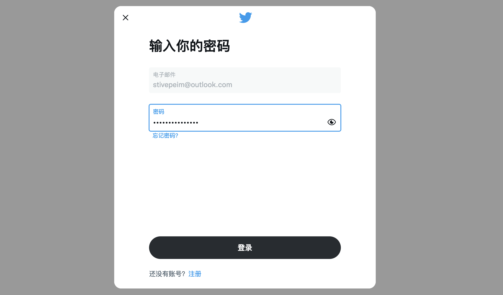

登录成功后 如下图点击

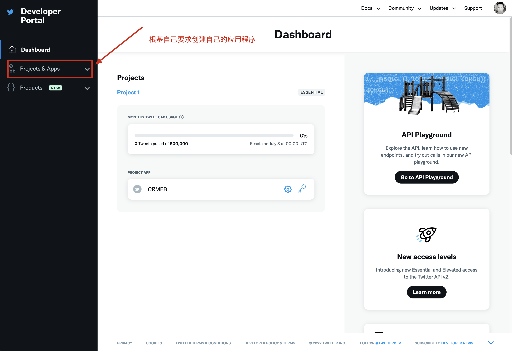

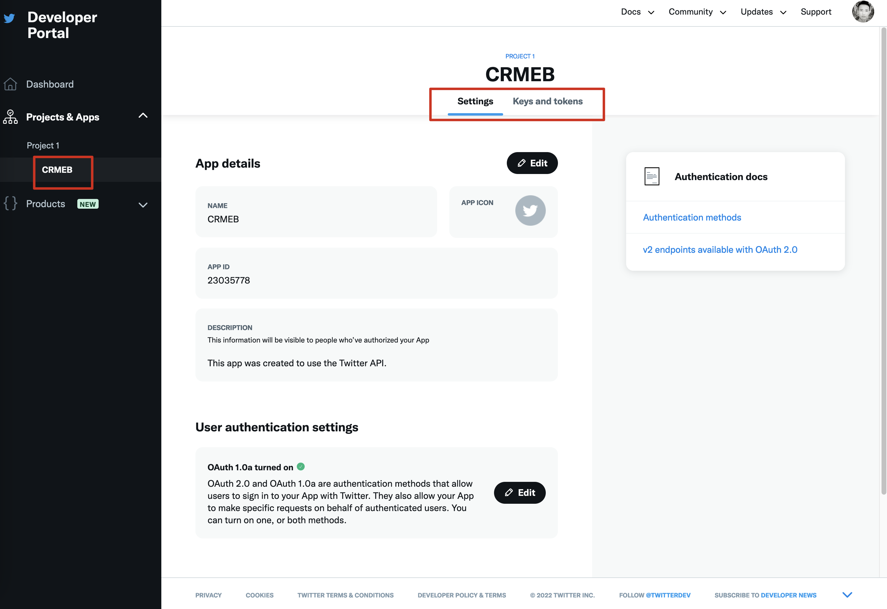

注意这里接入的是OAuth 1.0 版本的api

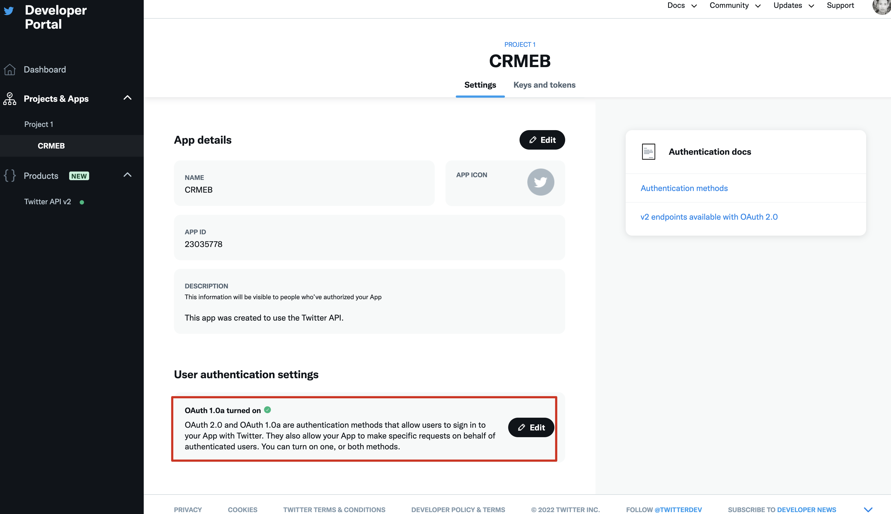

如上图点击编辑设置详细，初次创建时直接设置。期间会弹出一些安全表单，以通过为准满足条件填写，不要挑战权威，封号没得商量。

确定选择的选项如下图

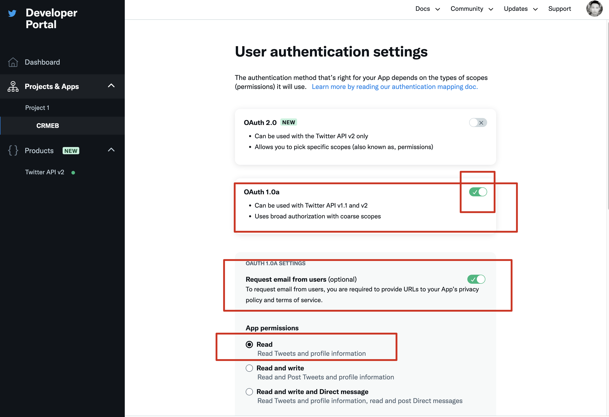

下图红框中的内容为回调地址，这里可以是多个，如果没指定回调跳哪个的时候回默认跳转第一个。

简单理解，这里相当于回调地址的白名单，设置所有平台中回调的地址。具体回调哪个，程序中指定即可。见下一张平台端设置截图。

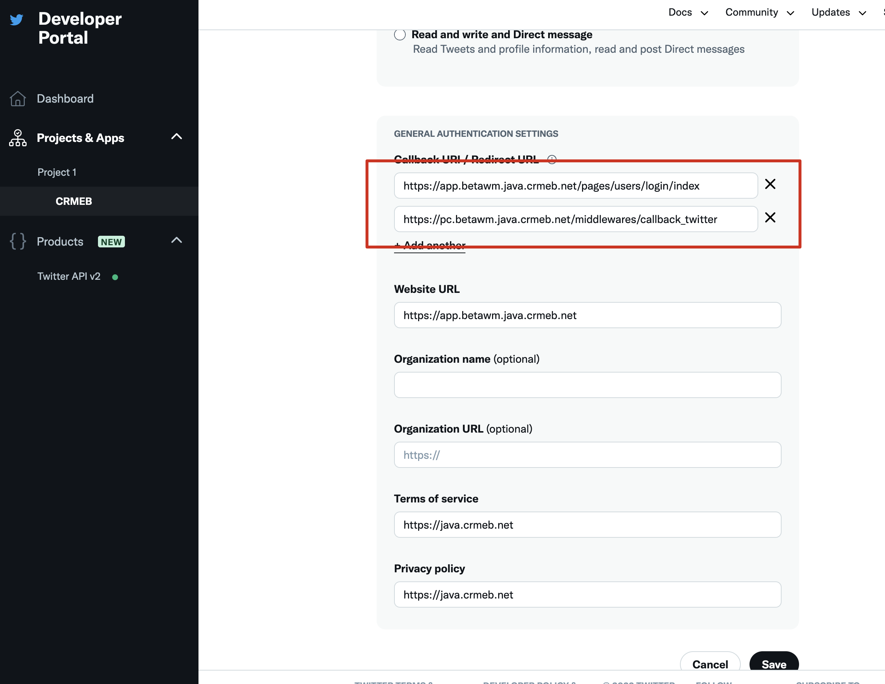

# 设置回调地址

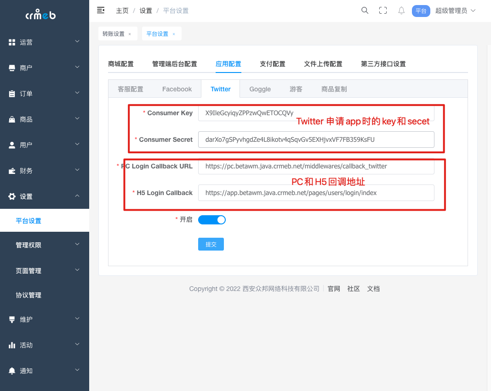

# 登录演示

| 发起twitter登录                          | twitter授权登录中                        | Twitter登录成功                          |
| ---------------------------------------- | ---------------------------------------- | ---------------------------------------- |
| 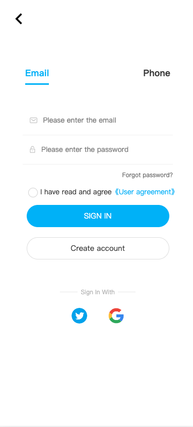 | 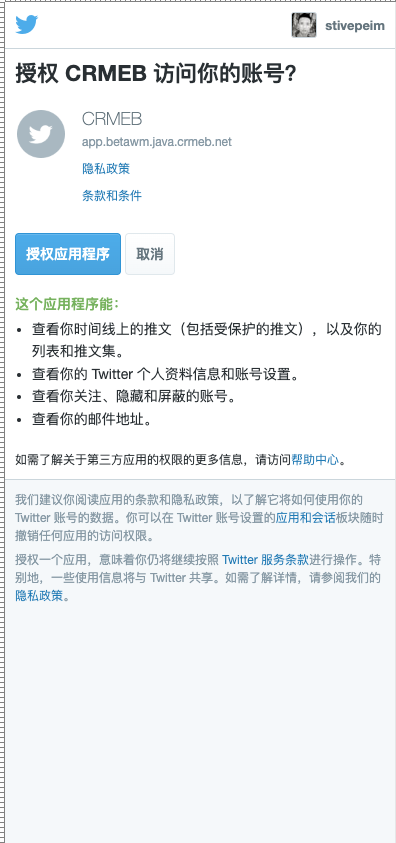 | 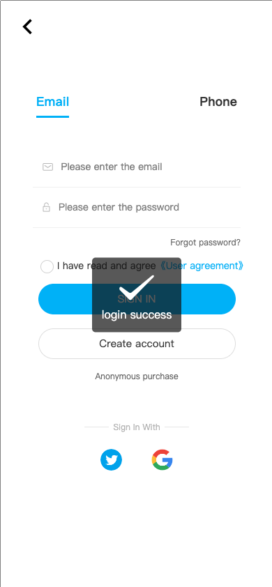 |

| pc 端 发起twitter 登录                                       | pc 端 twitter登录跳转中                                      |
| ------------------------------------------------------------ | ------------------------------------------------------------ |
| 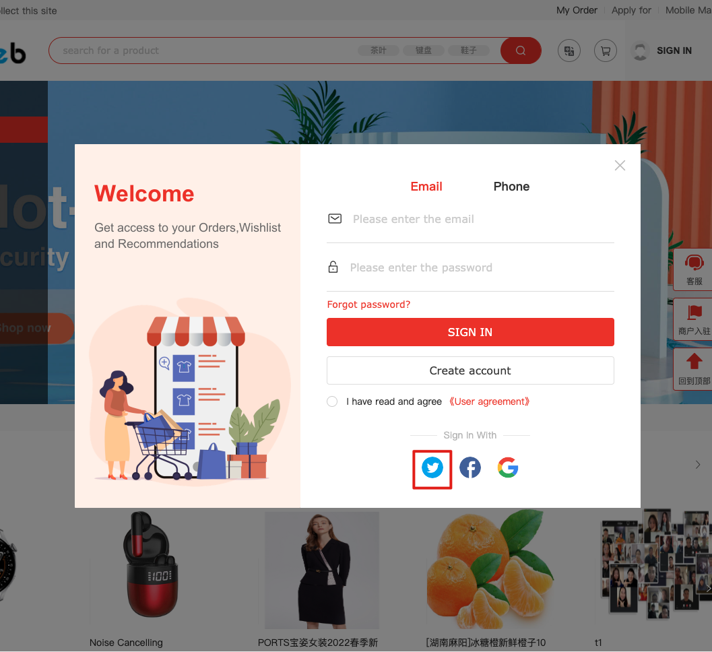 | 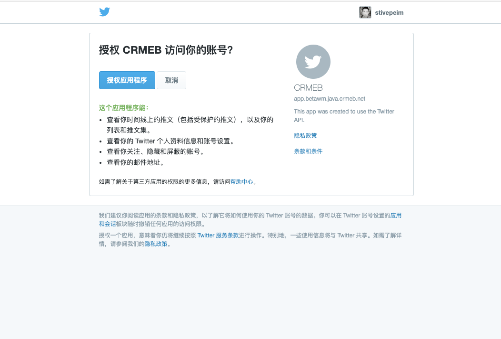 |

如下图，我的twitter登录成功，很早创建的，全网统一的名字，是不是修改为 大粽子 比较好一点 🐶。

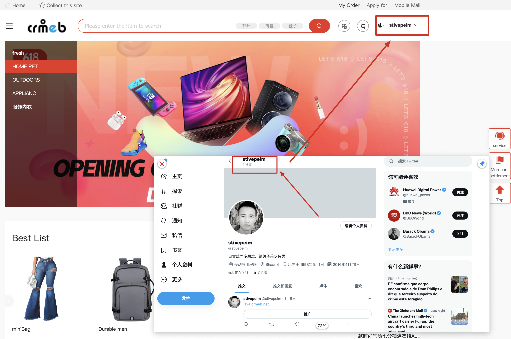

