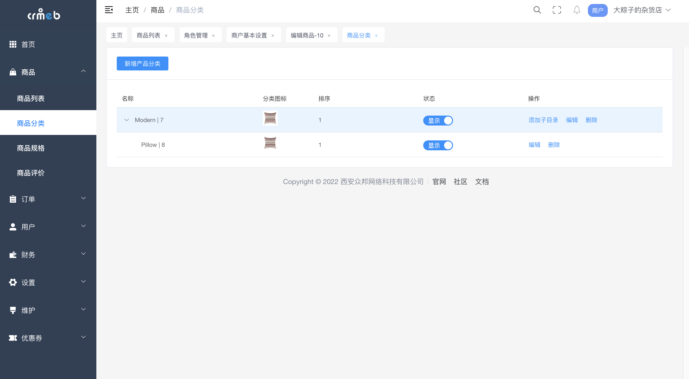
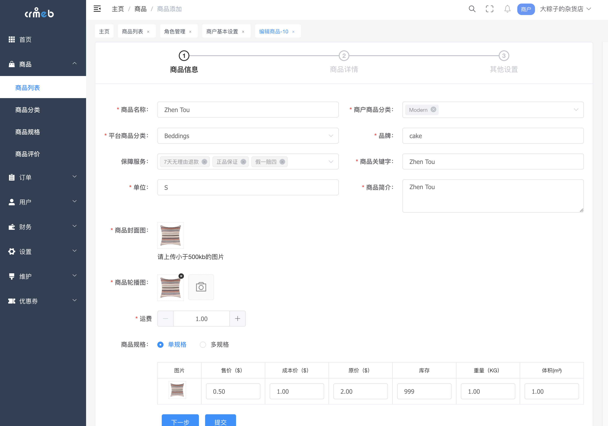
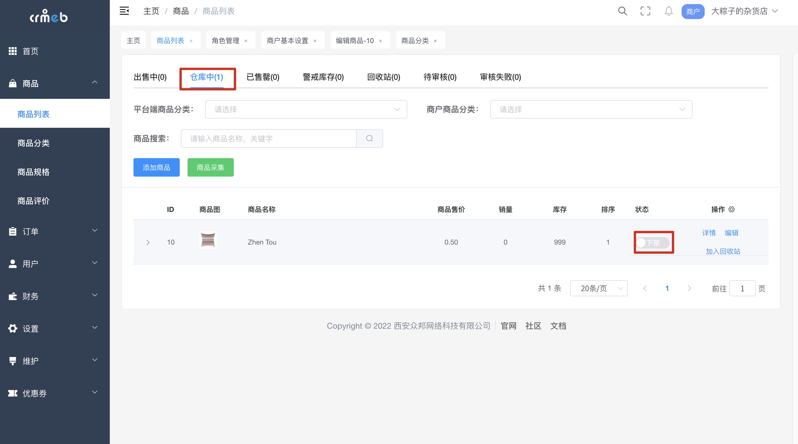
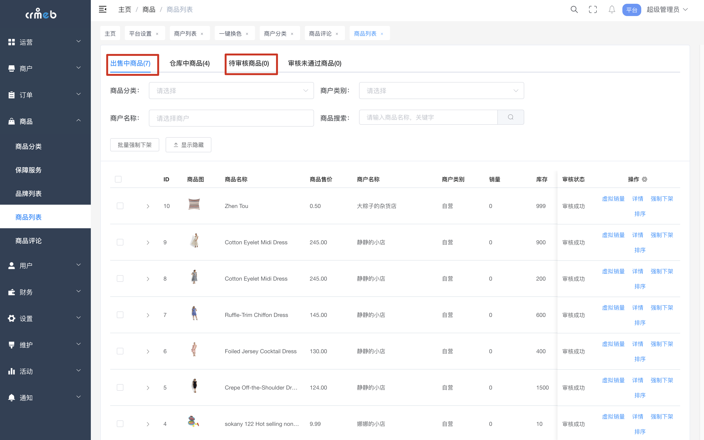
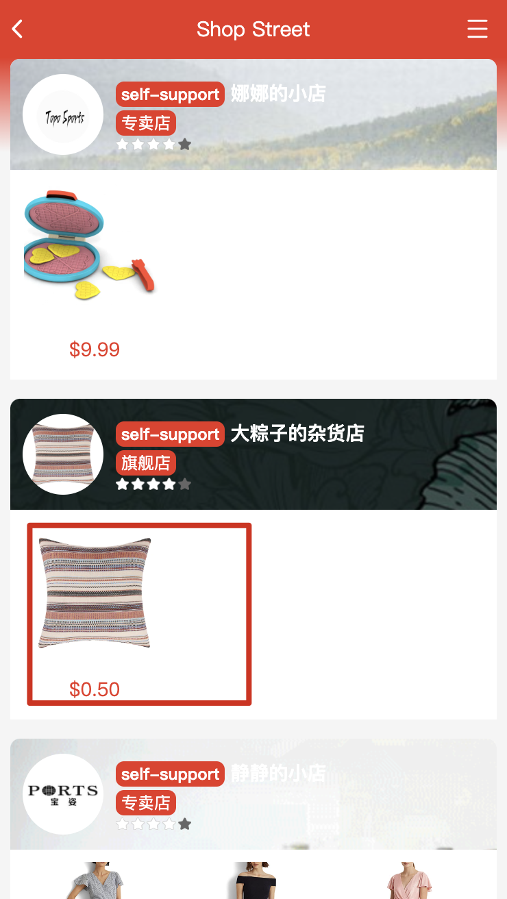
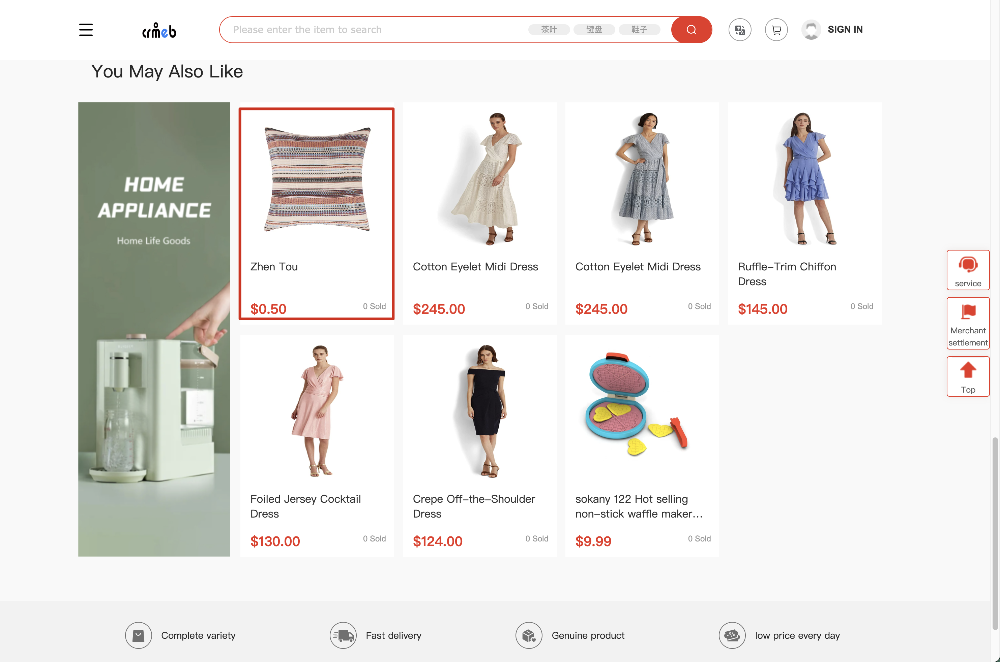

# 上架商品

### 端说明：

#### **平台端**：平台搭建者，对线上商品，商户有全权掌握的能力，但不创建商品，仅仅审核入驻商家，商品上架，以及配置平台流成性配置，比如短信通知，邮件通知，客服，首页活动，支持的快递等等。

#### **商户端**：

1. 商户只能在平台搭建后入驻进来，可以从H5端或者商城端入驻，也就是说得有平台在先。
2. 成为商户后正常流程开启后 可以创建商品，创建和上架商品。
3. 商品审核 有两种，一种是每次更新商品都需要审核，一种是免审，这个是在成为商户时确定的，或者根据商户运行一段时间的信用资质等修改。
4. 只有审核过的商品和免审的商家上传的商品，会出现在商城中，同时出现在H5端和移动端。

成为商户可以看上篇 申请商户

#### 创建商品

创建商品之前一定要在商品分类中事先维护好商品分类

一步步创建完商品

在商品仓库中点击上架，上架后平台端审核该商品。

#### 审核商品

如下图提示，免审核的商品直接出现在出售中的商品，待审核的tab则是待审核商品。且如下图，体现平台对商品的全权掌握，有**强制下架**功能。下架的商品商家可通过编辑再次提审。

#### 出现在商城中

| 移动端商城                                                   | PC端商城                              |
| ------------------------------------------------------------ | ------------------------------------- |
|  |  |

