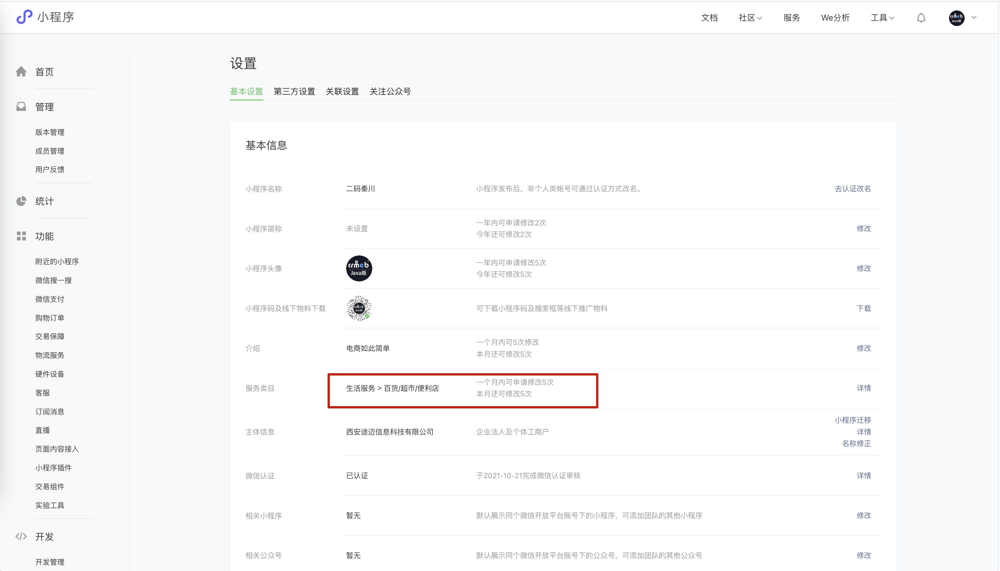
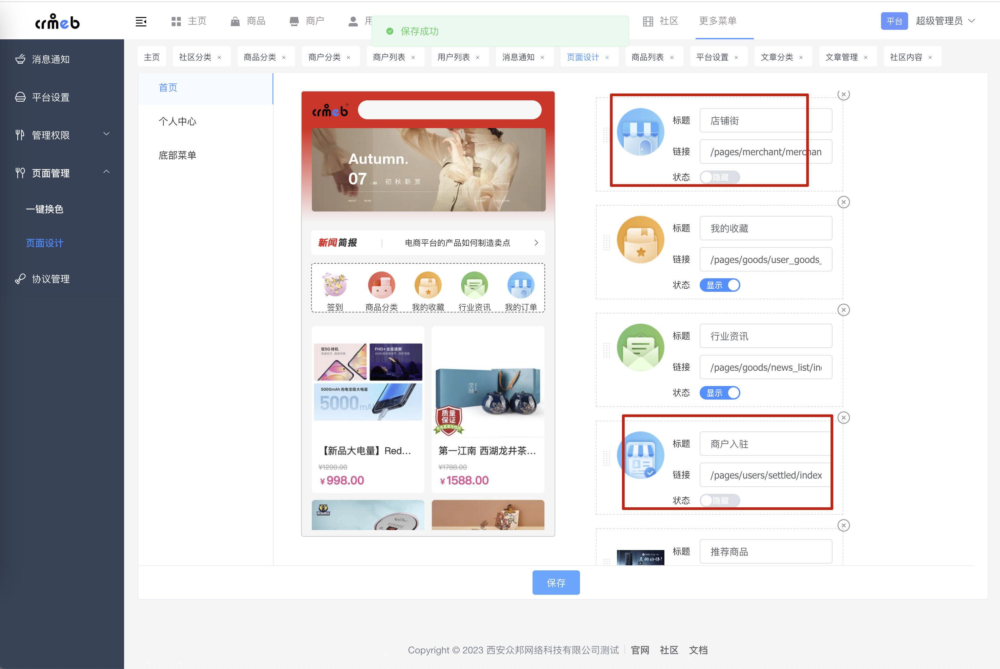
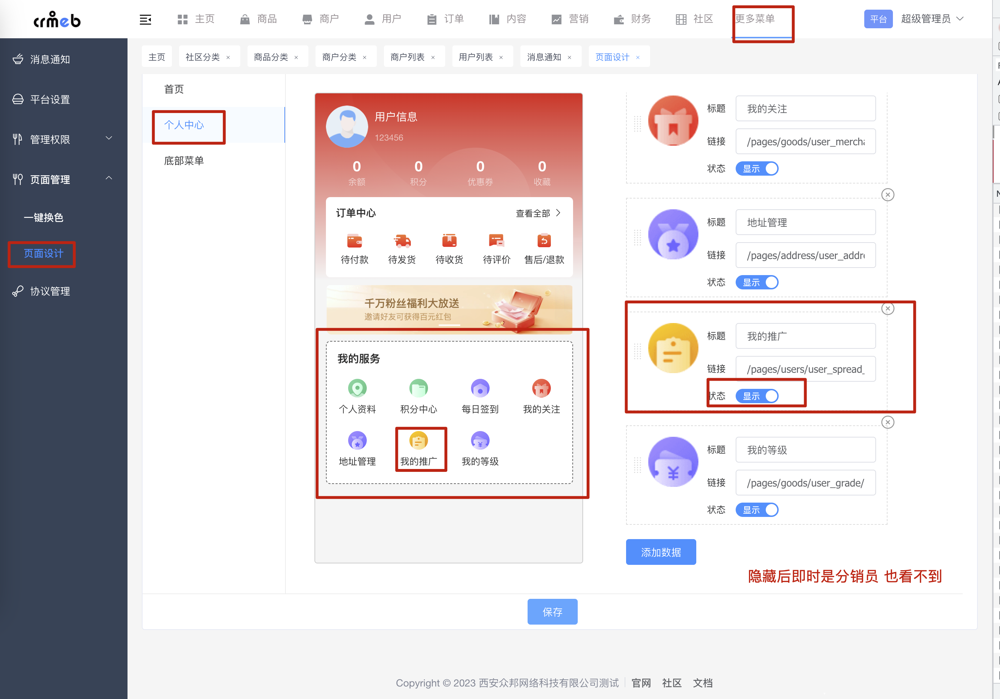
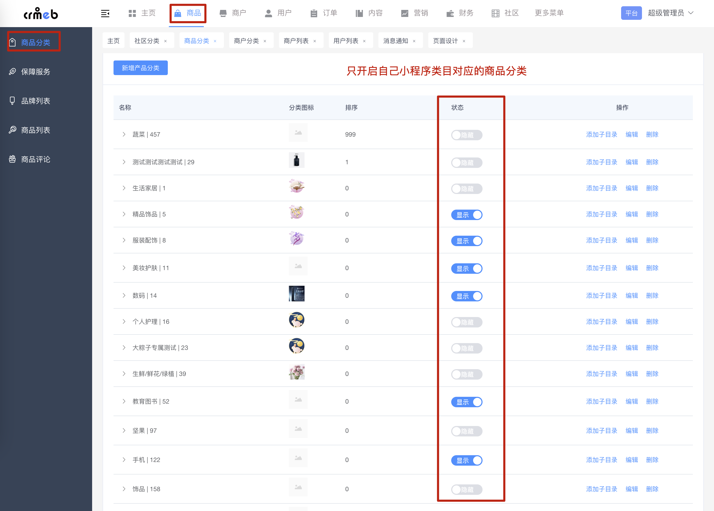
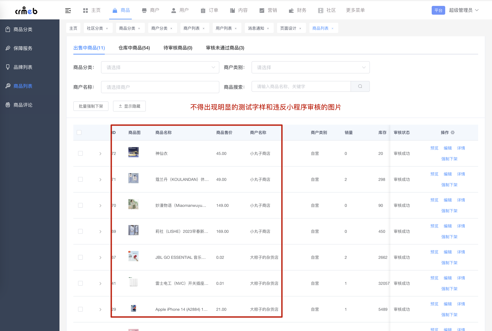
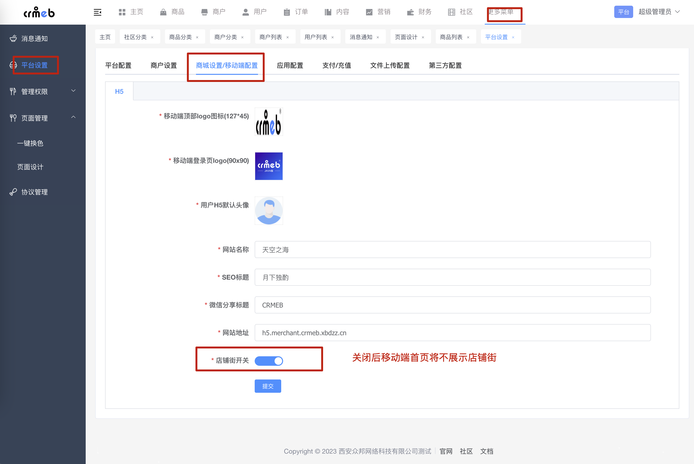
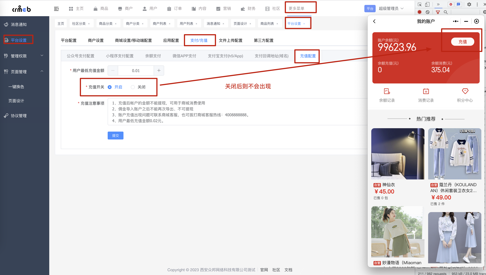
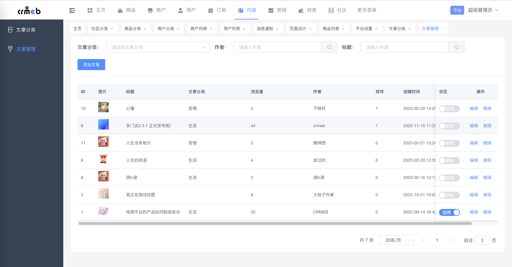
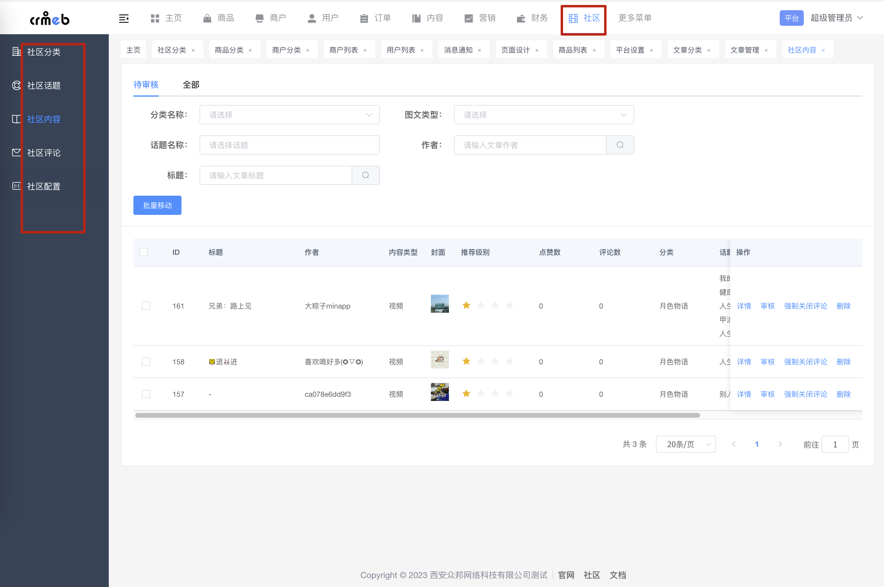

# Java多商户小程序过审经历总结

### 多商户需求量越来越大

随着很多公司和大多数开发者使用CRMEB java版本多商户系统开发。

本帖子针对前端开发（全站大佬）阅读，初次和版本更新都需要如下操作，切记被拒一次后面再通过就不容易了。

### 修改前后的对比

### 开发中小程序类目限制

[小程序官方审核被驳回常见问题](https://developers.weixin.qq.com/community/develop/doc/0002caeb3c82583722f9cb09456409?highLine=%25E5%25B0%258F%25E7%25A8%258B%25E5%25BA%258F%25E5%25AE%25A1%25E6%25A0%25B8)

不管介于什么原因，开发也好，资质问题也好，我们再次仅仅讨论不能申请电商类目的朋友。（大多数针对开发者）

如下图类目，都是根据自己资质申请的，可以修改，这里只以下图为例，并非一定和图片保持一致。

就因为大家类目有多种多样的，这里仅根据现在大家遇到的问题整理后给出的一些方案，如遇特殊可wx：xbdazz 讨论

### 满足小程序审核需求

注意：审核需求以2023年4月为准，审核标准会随着市场变化而变化，如果后面的朋友用如下方法还是审核不过可以联系wx：xbdazz一起讨论。

[小程序的官方说明 戳这里](https://developers.weixin.qq.com/miniprogram/product/material/#%E9%9D%9E%E4%B8%AA%E4%BA%BA%E4%B8%BB%E4%BD%93%E5%B0%8F%E7%A8%8B%E5%BA%8F%E5%BC%80%E6%94%BE%E7%9A%84%E6%9C%8D%E5%8A%A1%E7%B1%BB%E7%9B%AE)

### 平台端对应的修改

为了满足小程序审核需求，无论单商户还是多商户都适合。宗旨是修改一切有可能引起小程序审核被拒的任何文字，包括自己二次开发的前端文字展示和对应的内容。

以下方法仅适合测试和短时间上线运营，**做大做强** 的话还是 **老老实实**的申请电商对应的证件，小程序有复审机制，现在过审不代表一直可以使用，开发中还是要更新版本的。

#### 金刚区

关闭金刚区的**店铺街**和**商户入驻**

#### 分销

分销在小程序审核规则中是不被允许的，但是为了满足大多数商家的需求，功能是有但是需要得当操作哦！以下图为例只是关闭分销入口。

#### 分类

如下图描述：只开启自己小程序对应的分类，注意不能以图为准哈，比如我们小程序类目是便利店，在微信审核中就不能出现 **生鲜** **珠宝** 以及明显的**测试数据**

#### 商品

无论是多商户还是单商户，都是如下描述：不得出现明显的**测试字样**以及**违反小程序审核的图片**

#### 店铺街

这里针对的是便利店的类目，如果你申请了电商还是不能过审请联系上面的wx讨论。

如果你不是电商类目，如下图操作

注意：前端开发也就是uniapp中我们为了方便更多的开发者，小程序地步的tabar有自定义和原生两种方式，下图的配置针对uniapp代码中的tabar自定义设置，也是我们的默认设置。

二开需要注意，如果吧uniapp中的tabar修改成原生的话，这里的配置将不生效，需要自己手动修改tabar。所以建议使用自定义tabar，这样就可以动态调整。

#### 充值

#### 文章

这里都是文字描述，根据自己的类目编写对应文字，或者根据被拒绝的理由对应修改。

#### 社区内容

如下图：社区内容在提审时不能出现和上述文章内容一样的违规描述。

### 小技巧

##### 分销会被频繁查出来，可以修改分销路由名称(注意全局搜索下跳转的位置也一并修改)

##### 第一次提审不过，后面只会越来越严格，可以换个开发者ID提交代码试下

##### 提审之前一定清理测试数据以及和系统业务不相干的文字

以上为CRMEB java团队在开发和提审小程序过程中的一些建议，如果根据上述文字修改还不能过审，欢迎在论坛发帖和更多的小伙伴一起出谋划策，祝你上线。