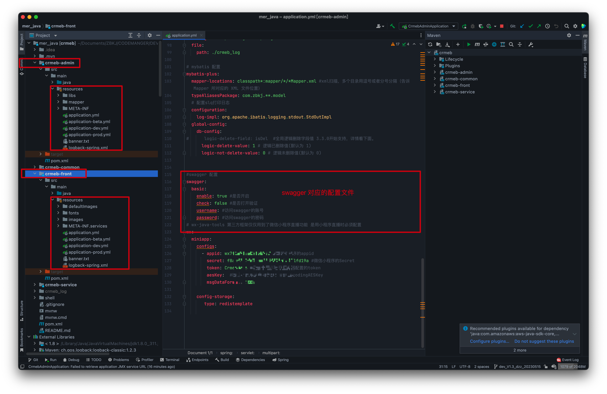
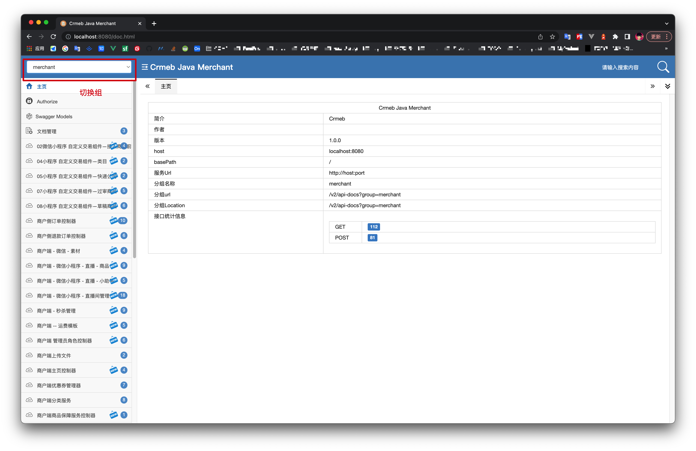
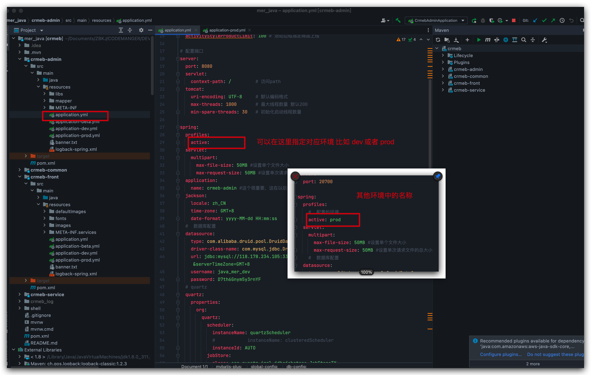
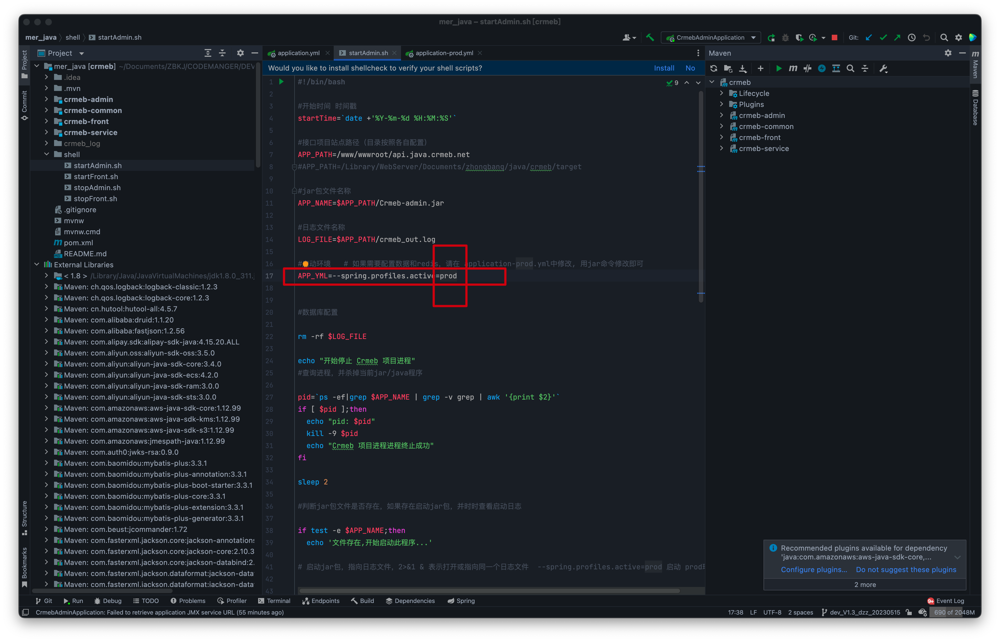
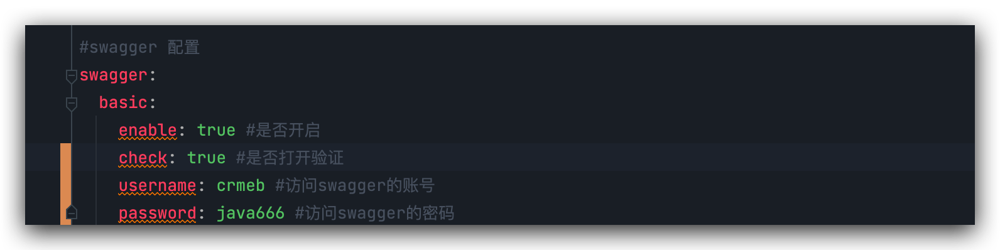
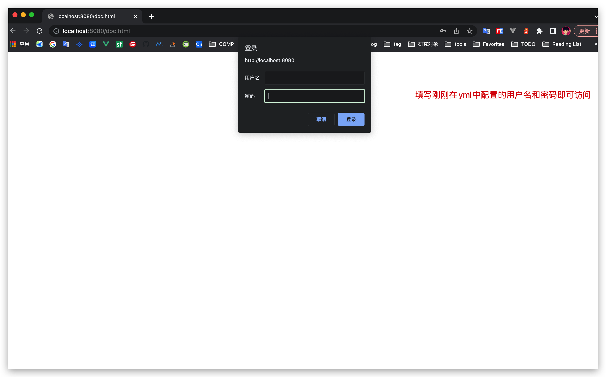
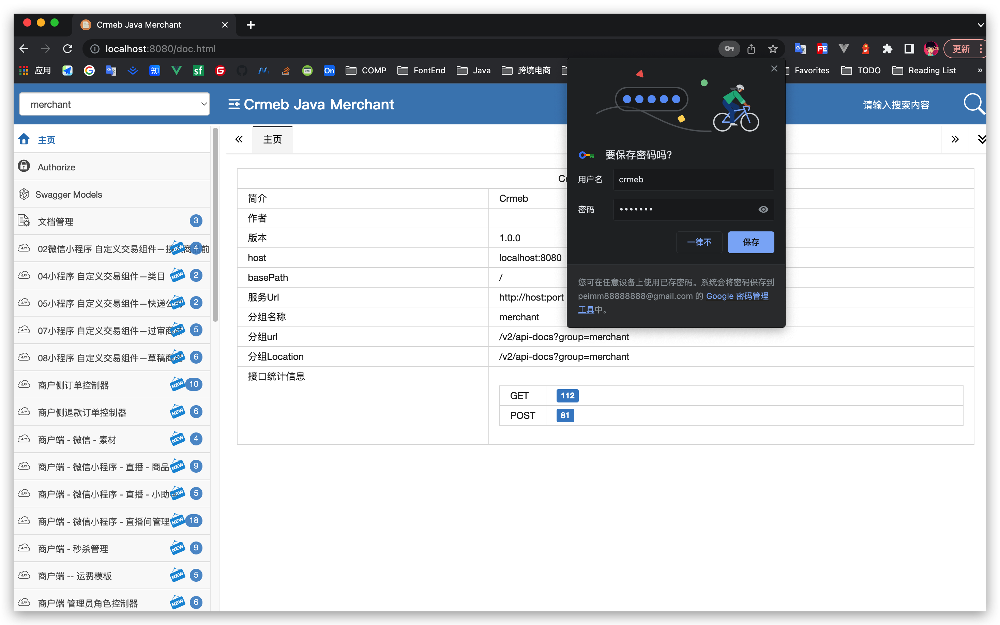

# Java项目Swagger在线文档配置和使用

可以说只要是前后端分离开发的项目都会使用RestFull接口规范开发，这样以来前后端的数据交互基本上全部基于接口调用，为了管理方便，都会使用在线生成的api文档，只用简单的注解和项目内必要的maven配置后就能实现。

尤其是在前后端分离开发模式，基本上各司其职，有一个相对比较全面的api文档，连参数和返回数据都能表明的话也较少很多沟通成本（扯皮）。

## 配置和优化

java项目分别分为4个模块

☕️🎉 生成的jar需要启动

| 模块名称      | 对应的业务                                                   |
| ------------- | ------------------------------------------------------------ |
| crmeb-admin   | ☕️🎉平台端和商户端后台服务 有启动类，需要将生成的jar启动当作后台服务，也就是admin API |
| crmeb-common  | admin包和front包都调用到的公共包，仅仅生成jar包供admin和front打包时使用 |
| crmeb-front   | ☕️🎉商城端api，也就是uniapp中要配置的api运行的对应服务，后期PC商城也链接此服务，jar包需要启动。 |
| crmeb-service | admin包和front包都调用到的公共业务包，仅仅生成kar包供admin和front打包时使用 |

从上面的模块描述可以得知我们打包后需要启动的jar分别有2个

管理端API服务		crmeb-admin 打包的 		Crmeb-admin.jar

移动端API服务		crmeb-front 打包的 			Crmeb-Front.jar

对应的两个启动项目下的Resource包下都有 **xxx.yml** 配置文件，需要修改如下配置

优秀的项目改造后的UI 方便使用**(程序员都很懒喜欢造工具)**

## 如何正常访问

上面两个启动jar对应的yml配置中都有关于swagger的配置，如果对应环境配置中没有的话会缺省使用基础yml中的配置项。

每个环境文件对应的端口都不一样，可以在基础yml中指定启动环境，或者外部命令指定环境文件。

**在yml中指定启动环境**

**在启动shell中修改环境**

## 如何添加访问账号和密码

如果是线上生产环境运行，建议不开启swagger，一方面为了安全，如果有需求需要开启，也可以配置密码访问。

修改对应yml中的配置

**如你所需：如果在二次开发中遇到新增controller get和post请求需要自定义参数和resopnse自定义返回数据的，可以根据现有的controller来模仿编写，真的需要的话可以在帖子中跟帖 +1哦**