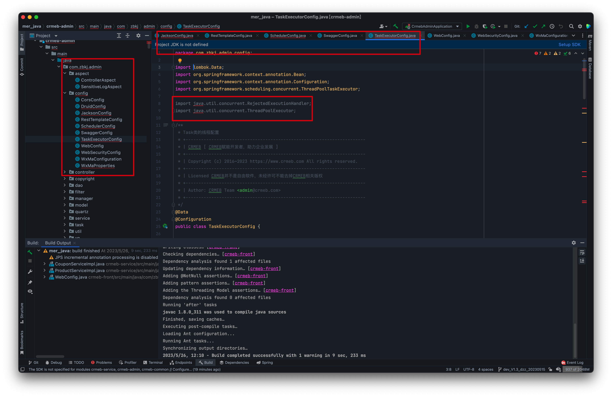

# CRMEB Java项目刚导入就全部爆红怎么处理啊？

## 要解决的错误

如图：几乎和jdk相关的都有报错，细心的同学已经看到猫腻 🤔

## 项目来源

无论你是从[官网](crmeb.com)下载的,还是从服务商购买，甚至是你的公司或者上级直接给你代码包，只要是正版的CRMEB Java代码都可适用。

## 项目导入目录

项目目录：已官网多商户最新的代码版本为例，单商户和外贸版本都可以参照。

| 包名称         | 对应的业务代码                                  |
| -------------- | ----------------------------------------------- |
| mer_admin      | WEB PC 商户管理端代码                           |
| mer_plat_admin | WEB PC 平台管理端代码                           |
| mer_java       | Java服务管理端代码                              |
| mer_app        | 移动端商城 H5 / 微信小程序 / APP(Android / IOS) |

**注意**：无论你用什么开发环境都需要在代码包中倒入对应的代码，文件夹不能选择错误，也就是说你不能直接在根目录中打开所有的项目，没个项目都有自己的特性，必须和开发环境对应。

## 爆红原因

每个项目都有自己的编译sdk，就比如java 你必须安装sdk才能正确编写java代码。

Vue项目你必须安装node js 以及对应的脚手架和正确加载node包的npm或者yarn。

php项目你也得安装对应的php版本以及http服务器。

也就是无论什么项目对应的SDK没安装或者设置不正确都会在解析和编译的时候出错，那么问题其实也就是没正确设置对应的变异环境导致的，细心的同学已经关掉网页去设置了。

## 处理方式

已mac为例，win也是在对应菜单下。

选择对应的jdk版本，此项目用到的是 sun jdk 1.8

或者在没设置jdk的时候直接点击编译项目，我们智能 的idea 已经提示你设置SDK了，打开后也是上面的弹窗，直接设置就好。

设置后项目会自动编译并索引文件信息

致辞你的java项目爆红已经消失，这里的索引和编译时间取决于你的电脑硬件性能。

## 愉快玩耍吧

CRMEB java项目的框架和业务都离不开每一个使用客服的支持，如果期间遇到任何和源码或者业务有关的问题都欢迎在论坛发帖留言。

[欢迎在论坛吐槽](https://www.crmeb.com/ask/thread/list/152)